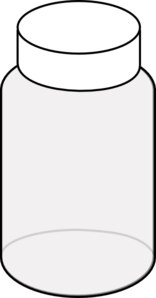
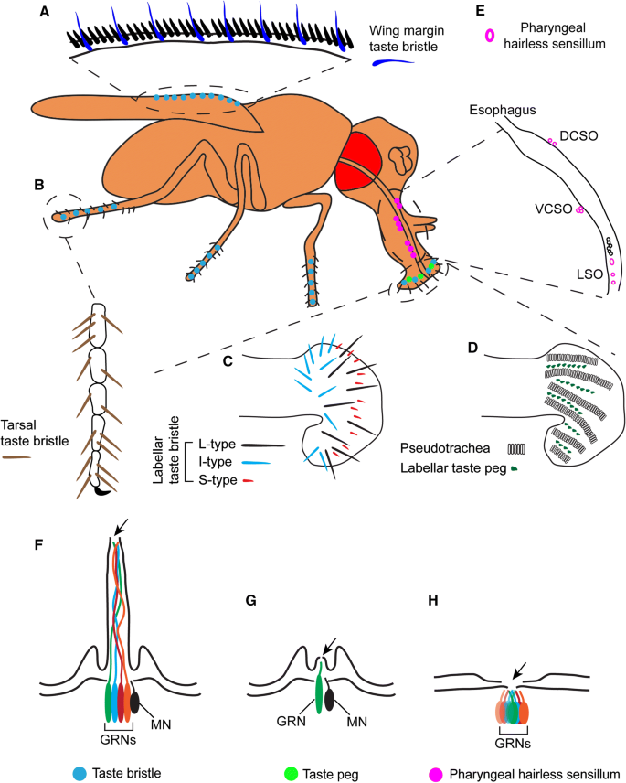
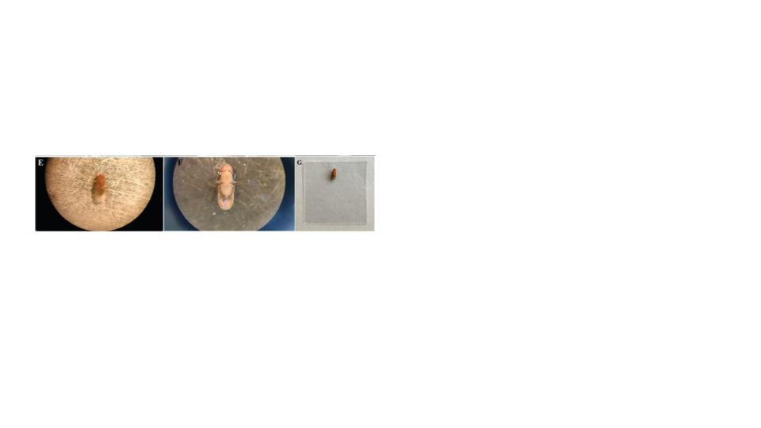
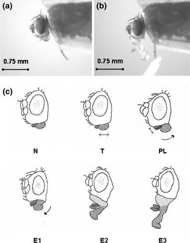
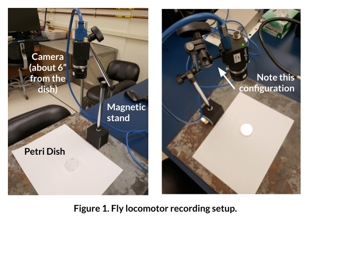
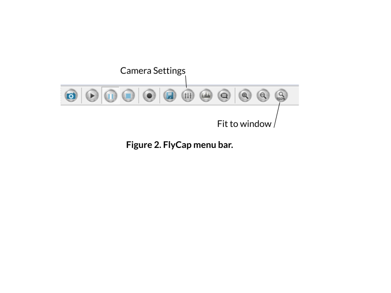
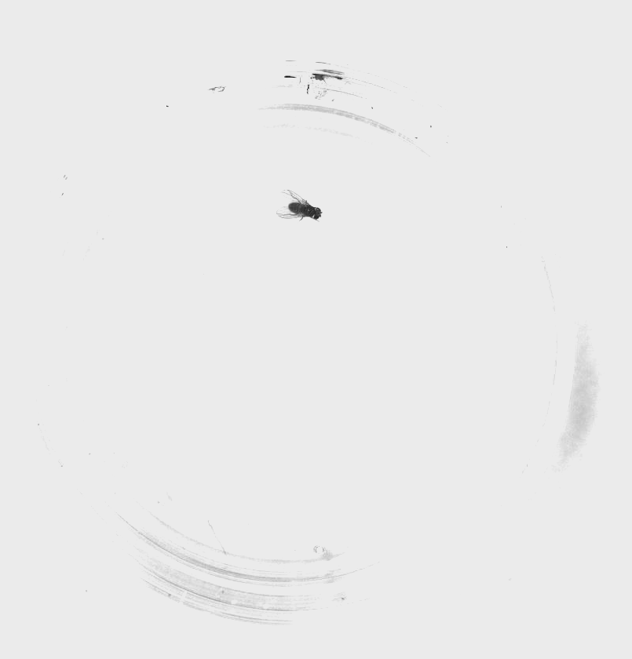
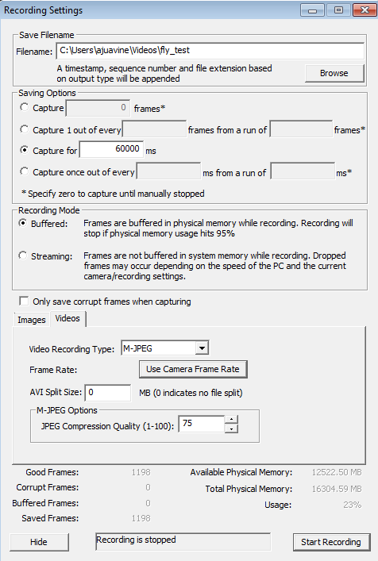
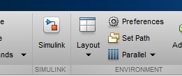

# Day 1: The Case of the Mislabeled Fly Vials

Something terrible has happened in the lab. The flies you once knew, that were once perfectly organized and labeled, are now completely jumbled. You're pretty sure the flies are transgenic, of some sort or another. It's up to you to figure out what type of flies these are, based on three behavioral assays: a **proboscis extension reflex (PER) assay, an ethological survey, and a locomotion test**.



Everyone will receive one batch of wildtype flies, and one batch of an experimental group. Ultimately, **you will present your findings to the class** (see Canvas for details) so that we can determine the phenotype of our mutant flies.

| **Supplies** | **Solutions** |
|---|---|
| Two vials of flies (~10 WT, ~10 Mutant/Knockout) | DI water |
| Dissecting microscope | 100 mM sucrose solution |
| Paintbrush | 40% EtOH in 100 mM sucrose solution |
| Large petri dish (lid or base) | |
| Clear cyanoacrylate glue | |
| 4 mL transfer pipette | |
| Coverslips (6 per fly group) | |
| Paper towels & KimWipes | |
| Plastic "fly recovery" box | |
| Petri dish with sylgard bottom | |
| Magnetic stand & camera | |

---

## Test I. Proboscis Extension Reflex (PER) Assay



The **proboscis extension** is the reflexive extension of the mouthpart (proboscis) in response to taste stimuli. It is a fundamental feeding behavior that can be stimulated by exposing the antennae, labellar hairs, or tarsi (last segments of the leg) to an appetitive taste stimulus.

While a solution with a low concentration of ethanol is appetitive to fruit flies (serving as an olfactory cue that plant-material fermentation has begun), higher concentrations (>10% EtOH) can be aversive and toxic to fruit flies. In this assay, you'll compare your wildtype flies to a knockout group across three solutions: sucrose (an appetitive stimulus), DI water (a neutral control), and 40% EtOH in sucrose (an aversive stimulus).

### Immobilization

1. Place fly tubes on ice for 2–3 minutes until flies are immobile.

   **Note:** Keep a close eye on your flies and do not leave them on ice too long! As soon as they're not moving, you can transfer them.

2. Place the bottom of the petri dish upside down on ice. Wipe away condensation before placing flies on the dish.
3. Using a brush, *very gently* isolate one fly onto the petri dish and *carefully* orient the fly so it is dorsal-side up (Figure E below). Be gentle — the flies are very fragile.
4. Prepare a coverslip: using the transfer pipette, place a tiny drop (1 μl, <2 mm in diameter) of glue on a coverslip.



5. Gently lower the coverslip onto the dorsal side of the fly, until just submerging the back and wings, immobilizing the fly in the glue (Figures F–G above).

   **Note:** Only the back should be submerged in the glue. The head, proboscis, and at least one leg should be exposed — if any one of those parts is submerged, try again with another fly. If you've only submerged the wings, try flipping the coverslip over and using forceps to gently lower the back into the glue.

6. Place one damp paper towel in the plastic container on your lab bench. Ensure the box is dry. Place the coverslip in the box and close the container to regulate humidity.
7. Repeat with the remaining flies. You should prepare **5 wildtype** and **5 knockout** flies.
8. Allow the flies to recover for at least **1.5 hours** before testing. Complete the other behavioral tests during the recovery period.

   **Note:** Omit flies that do not show movement after 1.5 hours of recovery.

### Running the PER assay

9. Choose one of your responsive, immobilized flies with accessible head and legs, and place it under the dissecting microscope. Set up your lighting so you can see the legs and proboscis.
10. Dip the corner of a KimWipe in the sucrose solution and gently touch the tarsi with the KimWipe for 3 seconds.

    

    a. Score the response in **Data Table 1**. Assign a **1** for proboscis extension (right image above) and a **0** for no extension (left image above).

    b. Wait 3 seconds or until the proboscis retracts.

    c. Repeat for **10 trials**.

11. Repeat using **DI water**.
12. Repeat using **40% EtOH in sucrose**.

### Data Table 1: PER Responses

| Genotype | Trial | Sucrose | DI Water | 40% EtOH in Sucrose |
|---|---|---|---|---|
| Wildtype | 1 | | | |
| Wildtype | 2 | | | |
| Wildtype | 3 | | | |
| Wildtype | 4 | | | |
| Wildtype | 5 | | | |
| Wildtype | 6 | | | |
| Wildtype | 7 | | | |
| Wildtype | 8 | | | |
| Wildtype | 9 | | | |
| Wildtype | 10 | | | |
| Knockout | 1 | | | |
| Knockout | 2 | | | |
| Knockout | 3 | | | |
| Knockout | 4 | | | |
| Knockout | 5 | | | |
| Knockout | 6 | | | |
| Knockout | 7 | | | |
| Knockout | 8 | | | |
| Knockout | 9 | | | |
| Knockout | 10 | | | |

**Reflection Question:** Identify the positive and negative controls in this experiment. With these controls in mind, are your findings as expected?

---

## Test II. Ethological approach to behavior

It's possible your flies do something different that's *not* captured by a standard behavioral assay. The best way to figure this out is to watch the flies, choose several behaviors to quantify, and see if those behaviors differ between your experimental and wildtype flies.

### Choosing behaviors to quantify

Your next goal for today will be to quantify **three** different behaviors that your flies perform. It is up to you to define and operationalize these behaviors.

1. Freeze both groups of flies for 2–3 minutes until they stop moving.
2. Isolate ~5 flies of each type in separate petri dishes.

   **Note:** Make sure they're completely awake and moving before moving on to the next step. This could take about 10 minutes.

3. Take a few minutes to observe both batches of flies.
4. Choose three different behaviors that the flies do, and record them below. You also need to provide a definition for each behavior.

**Table 1.**

| Behavior name | Definition | # Instances in WT | # Instances in Mutant |
|---|---|---|---|
| | | | |
| | | | |
| | | | |

5. For 5 minutes, each person in your group should observe one behavior and record the number of instances those behaviors happen in the WT flies. Record the number of instances in the table above.
6. Do the same for the experimental group.

---

## Test III. Recording locomotor behavior

For the final test, you'll record the movement of your two different types of flies in a petri dish and use an automated tracking program to track the velocity and heading of your flies. Your mutants might have altered locomotor behavior — this will help you test that.

### Set up your camera



First, we need to arrange the camera and petri dish so that you can get everything in frame, in focus, and well lit.

1. Ensure that your camera is connected via the USB cord to the computer. The camera should be plugged into a USB 3.0 slot (the blue ones).
2. Set up your camera and petri dish as in the figure above. You want your camera to be about 6 inches from the petri dish.
3. On the computer, open **Point Grey FlyCap2**.
4. Make sure that it recognizes a "Flea3" camera, and press OK.
5. Adjust the **focal length** knob on your camera (closest to end, ranges from infinity to 0.1) in order to get the image in focus.
6. Adjust the image on your screen using the toolbar at the top:

   

7. Isolate one fly in your petri dish.
8. Click on the button to open up the Camera settings (e.g., exposure).

   a. Uncheck *auto* for brightness, exposure, and shutter.

   b. Increase the exposure almost to the point where your image is overexposed. You want the flies to stand out very clearly against the white background, and the edges of the petri dish to be invisible:

   

9. Ensure that you can easily see your fly throughout all areas of the arena.

   **Note:** Optimizing the way your fly recording looks will make the tracking *much* easier. Make sure there are no glares from lights in the room, no dark spots on the petri dish, and clean off any fingerprints on the glass. **Every light and dark spot matters, and anything can throw off the tracking.**

### Set up your flies & record



1. When you're ready to record, go to **File > Capture Image or Video**.
2. A dialogue will pop up. Set up a 60 second recording with the following settings:

   - **Filename:** browse to create your own (make sure you label it as WT or Knockout). **SAVE YOUR FILE LOCALLY**, not on your username server. **Your video file will not save correctly if you do not do this.**
   - 🔘 Capture for 60000 ms
   - 🔘 Buffered
   - (Click on **Videos** tab)
   - **Video Recording Type:** M-JPEG
   - **Frame Rate:** 15.0
   - **AVI Split Size:** 0
   - **JPEG Compression Quality:** 75

3. Press **Start Recording**, and wait while the program records the video.

   **Note:** This window will not close, but the message at the bottom will change.

4. When it is done, **check that the video recorded correctly by finding the file and opening it.**

   **Note:** If it didn't record correctly, close FlyCap, unplug the camera, and retry.

5. For the first fly you record, **move on to the next step to ensure that your video works well for tracking. If the tracking doesn't work well, you'll need to adjust your lighting and/or image acquisition.**
6. When you're confident the tracking works well with your videos, obtain videos for three flies from each group (you've already done one).
7. When you're done, save your videos in a clouded location for safekeeping.
8. Close FlyCap.

### Quantify your locomotor behavior

Now that you have videos of your specimen, you need to quantify the locomotor behavior. We'll use a MATLAB program to do so.

#### Download the code we need

1. Download the code for **fly_tracker** from GitHub: [https://github.com/ajuavinett/fly_tracker](https://github.com/ajuavinett/fly_tracker)
2. Extract all of the contents of the zipped folder into your **local** Documents folder (*not* a folder on your username).
3. Open MATLAB.
4. On the top bar of MATLAB, find the "Set Path" button:

   

5. In this window, click "Add with Subfolders."
6. Navigate to the folder where you extracted fly_tracker. Hit **Save**.

   **Note:** You might get an error about pathdef.m. Select **Yes** and save this file in your **local** Documents folder.

#### Test the tracking for a sample video

7. In the MATLAB window, type:

   ```matlab
   [mean_velocity SEM_velocity] = BIPN145_flytrack
   ```

   and press enter.

8. Navigate to where your movie is and select it.
9. In the next window, draw a rectangle (click and drag) around your entire petri dish.
10. Double-click inside the rectangle to initiate tracking.
11. Wait for the tracking to finish. A window will pop up that shows the trajectory of your fly and its velocity across time.

    **Note:** If you'd like to edit these figures in any way, you can go to **Tools > Edit Plot.**

#### Run your analysis for a group of flies

Once you've tested your tracking & recorded all of your movies, you can run this script for **several movies** at a time (e.g., one group of flies). You should record videos for 3 WT flies and 3 mutant flies. Do this by re-doing steps 7–11 above, but **select all of the videos for one group of flies** in the window where you are asked to pick a movie. After you've done the analysis for your wildtype flies, run the `BIPN145_flytrack` script again with your mutant fly videos.

The script outputs a variable called `mean_velocity`. This will show the mean velocity (in mm/s) for *each* of your videos. `SEM_velocity` is the standard error of the mean of the velocity for these videos.

To generate a mean value for the video(s) you just tracked, type:

```matlab
mean(mean_velocity)
```

and press enter.

Record these values in the table below (you'll ultimately want to plot these).

**Table 2.** Comparison of mean velocities for control and mutant flies.

|  | **Control** | **Mutant** |
|---|---|---|
| Mean | | |
| SEM | | |

## Troubleshooting

| **Observation** | **Likely issue(s)** | **Possible solution** |
|---|---|---|
| The camera output is black | Lens cap is on | Remove the lens cap |
| Camera not recognized | Camera not plugged in | Plug in the camera |
| Video file is not recognized in MATLAB or the movie is the wrong length/size | You wrote the video file to the server | You need to re-record your video but with the file saved **directly to the computer locally** |
| Fly does not extend proboscis to sucrose | Fly is dehydrated or improperly mounted | Check humidity in recovery box; verify proboscis and at least one leg are not stuck in glue |
| All flies look the same in tracking video | Lighting/exposure issues | Increase exposure so flies stand out as dark spots on a fully white background |
