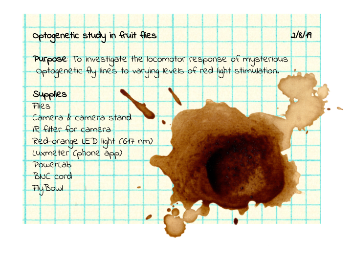

# Day 2: The Case of the Missing Methods

Just when you thought everything was back to normal in the lab, a remarkably inconveniently placed coffee spill completely drenches several pages of the notes given to you from your mentor.

Unfortunately, those pages detailed all of the methods that you needed in order to perform your experiment. You've managed to save the supplies list, at least:

Hope is not lost. You've got some supplies, and you suspect that this study had something to do with the role of the genetically-modified neurons. Certain neurons have optogenetic channels, but what do those neurons actually control?

It might take a little bit of research to refresh your memories about those transgenic flies, but that's easy enough. And you've done at least some fly behavior before — you're pretty much the fly whisperer.

You can re-write the protocol and get some interesting results, can't you?

## Tips for designing your experiment

You can control the intensity of the light source through LabChart by following these steps:

1. Plug the BNC input on the light into the **OUTPUT** of the PowerLab using a BNC cable.
2. Program the stimulator (**Setup > Stimulator**) to send different pulses with heights from 2V – 10V. You should notice that the intensity of the light changes with more voltage.

   ***Do not*** stimulate your flies at higher than 1 Hz frequency or with stimulus pulses longer than 0.5 seconds.

3. Measure the intensity of the light using a phone app luxmeter (we recommend *Lux Light Meter Free*). You should measure the light intensity **from the same distance** as you are using it in the experiment.

Don't forget about control groups! It may help to compare these flies to each other, as well as to wildtype flies. We have wildtype flies if you need them.

You will need to put the red light **within several inches** of your flies in order to see an effect of the stimulation.
