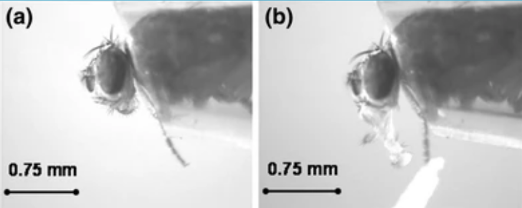
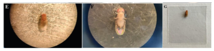

# Proboscis Extension Reflex (PER) Assay

The **proboscis extension** is the reflexive extension of the mouthpart (proboscis) in response to taste stimuli. It is a fundamental feeding behavior that can be stimulated by exposing the antennae, labellar hairs, or tarsi (last segments of the leg) to an appetitive taste stimulus. This approach has been used to investigate the neural circuit, including gustatory sensory neurons, taste projection neurons, and proboscis motor neurons (e.g. [Shiu et al., 2022](https://elifesciences.org/articles/79887)).

## Immobilization

1. Place fly tubes on ice for 2–3 minutes until flies are immobile.

:::{admonition} Keep an eye on your flies!
:class: danger
Do not leave your flies on ice too long! As soon as they're not moving, you can transfer them.
:::

2. Place the bottom of the petri dish upside down on ice. Wipe away condensation before placing flies on the dish.
3. Using a brush, *very gently* isolate one fly onto the petri dish and *carefully* orient the fly so it is dorsal-side up (Panel E in the figure below). Be gentle — the flies are very fragile.
4. Prepare a coverslip: using the transfer pipette, place a tiny drop (1 μl, <2 mm in diameter) of glue on a coverslip.

5. Gently lower the coverslip onto the dorsal side of the fly, until just submerging the back and wings, immobilizing the fly in the glue (Figures F–G above).

:::{admonition} Carefully mount your flies
:class: danger
Only the back should be submerged in the glue. The head, proboscis, and at least one leg should be exposed — if any one of those parts is submerged, try again with another fly. If you've only submerged the wings, try flipping the coverslip over and using forceps to gently lower the back into the glue.
:::

6. Place one damp paper towel in the plastic container on your lab bench. Ensure the box is dry. Place the coverslip in the box and close the container to regulate humidity.
7. Repeat with the remaining flies. You should prepare **10** flies total.
8. Allow the flies to recover for at least **1.5 hours** before testing. Complete the other behavioral tests during the recovery period.

## Running the PER assay

1. Identify the flies that are moving after the rest period.

2. Place the cover slip under the microscope. Use a syringe to deliver a droplet of water to satiate the fly, preventing thirst-induced proboscis extensions.

3. Put on your laser blocking glasses.

:::{admonition} Eye protection
:class: danger
Eye protection that can filter out red laser/light is essential when observing the red light through the microscope.
:::

4. Manually hold a red laser pointer to shine red light at the proboscis/head of a single fly (700 lux) while observing the PER response through the microscope.

5. Observe and record proboscis extension within a 30-s window. Score each fly using the following recording system: 

| Score | Description |
|---|---|
| 0 | No extension |
| 0.5 | Extension lasts 1–2 s |
| 1 | Extension lasts over 3 s |

6. After testing light-induced proboscis extension, examine the response to 4% sucrose using a syringe. Expel a droplet of sucrose at the end of the needle and bring it close to the fly proboscis. **Discard the data from flies that fail to respond to the sucrose droplet.**

7. Repeat with your wildtype flies.

:::{admonition} Guesses, please!
:class: tip
Based on your proboscis extension results, do you think you have Gr5a>CsChrimson or Gr66a>CsChrimson flies?
:::