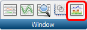
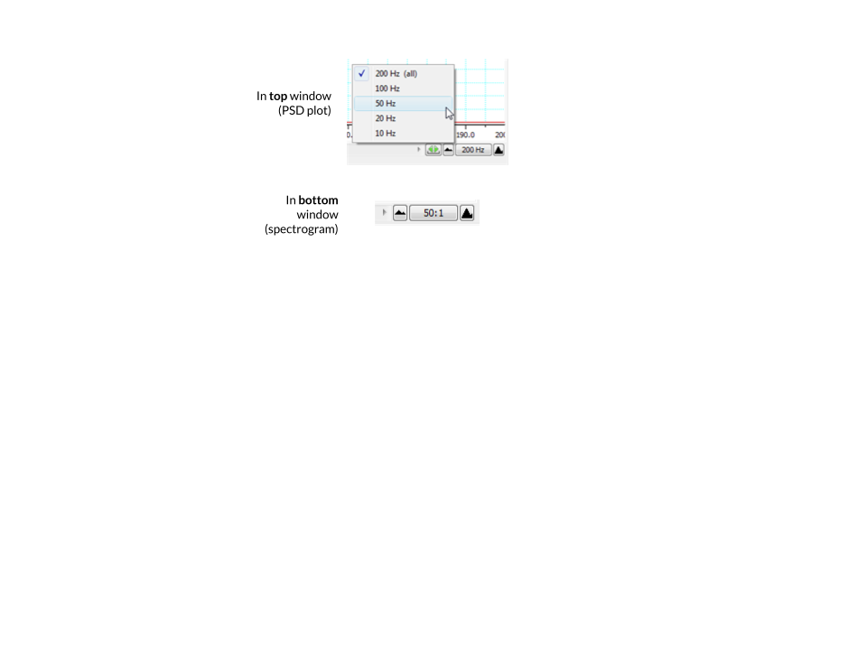
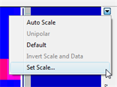
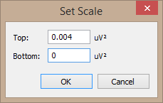
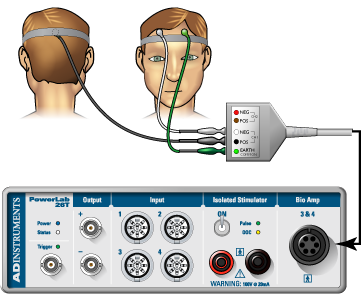
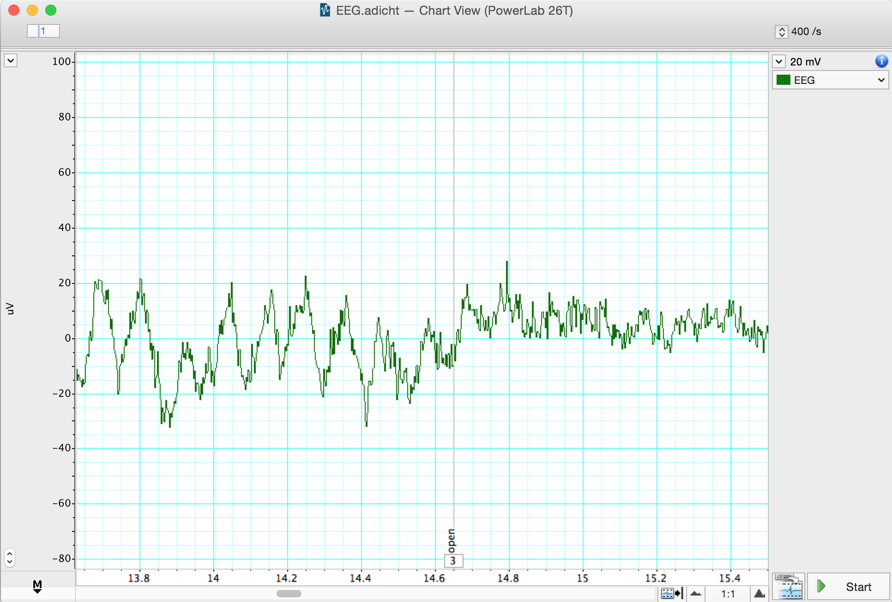
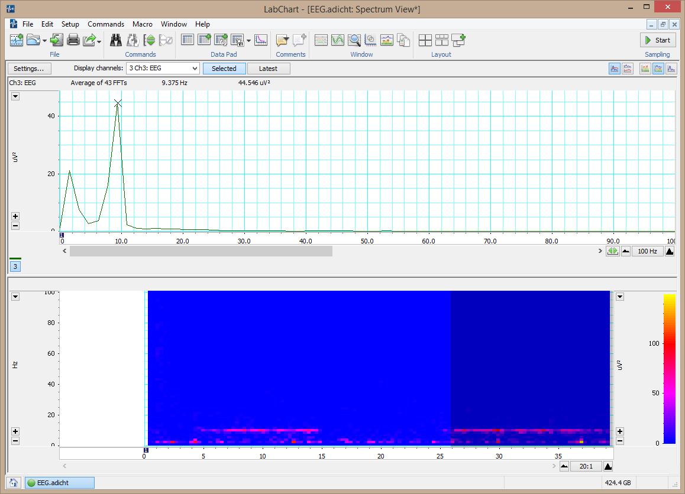

# Measuring Alpha Wave Activity Using EEG

## Background & Goals

The cerebral cortex contains huge numbers of neurons. Activity of these neurons is — to some extent — synchronized in regular firing rhythms. These are referred to as brain waves. Electrodes placed in pairs on the scalp can pick up variations in electrical potential that derive from this underlying cortical activity. This recording of the electrical activity in the cortex is called an electroencephalogram (EEG). EEG signals are strongly affected by different states of arousal and show characteristic changes in different stages of sleep. EEG signals are also affected by stimulation from the external environment and brain waves can become entrained to external stimuli. Electroencephalography is used, among other things, in the diagnosis of epilepsy and the diagnosis of brain death.

### Recording EEG signals

EEG recording is technically difficult, mainly because of the small size of the voltage signals, which are typically 50 µV **peak-to-peak**. The signals are small because the recording electrodes are separated from the brain's surface by the scalp, the skull, and a layer of cerebrospinal fluid. A specially designed amplifier, such as the Bio Amp built into the PowerLab, is essential to record EEGs. It is also important to use electrodes made of the right material and to connect them properly. Even with these precautions, recordings may be spoiled by a range of unwanted interfering influences, known as artifacts.

In this lab, you will record EEG activity with an occipital electrode on the scalp at the back of the head. A third (ground or earth) electrode is also attached, to reduce electrical interference. In clinical EEG, it is usual to record many channels of activity from multiple recording electrodes placed in an array over the head.

### Origins of the EEG signals

The EEG results from slow changes in the membrane potentials of cortical neurons, especially the excitatory and inhibitory post-synaptic potentials (EPSPs and IPSPs). Very little contribution normally comes from action potentials propagated along nerve axons. The EEG reflects the sum of the electrical potential changes occurring from large populations of cells. Therefore, large amplitude waves require the synchronous activity of a large number of neurons. The rhythmic events that these waves reflect often arise in the thalamus whose activity is in turn affected by a variety of inputs including structures in the brainstem reticular formation.

### Components of the EEG waveform

The EEG waveform contains component waves of different frequencies. These can be extracted and provide information about different brain activities. The types of brain waves are:

- **alpha** (between 8 to 13 Hz; average amplitudes of 30 to 50 µV peak-to-peak), which will be studied in this experiment. Alpha rhythm is seen when the eyes are closed and the volunteer relaxed. It is abolished by eye opening and by mental effort such as doing calculations or concentrating on an idea. It is thus thought to indicate the degree of cortical activation. The greater the activation, the lower the alpha activity. Alpha waves are strongest over the occipital (back of the head) cortex and also over the frontal cortex.

- **beta** (13 to 30 Hz; <20 µV peak-to-peak), which are prominent in alert individuals with their eyes open. The beta rhythm may be absent or reduced in areas of cortical damage and can be accentuated by sedative-hypnotic drugs such as benzodiazepines and barbiturates.

- **theta** (4 to 8 Hz; <30 µV peak-to-peak), which are seen in awake children but not adults. The theta rhythm is normal during sleep at all ages. However, some researchers separate this frequency band into two components: low theta (4–5.45 Hz) activity correlated with decreased arousal and increased drowsiness, and high theta (6–7.45 Hz) activity that is claimed to be enhanced during tasks involving working memory.

- **delta** (0.5 to 4 Hz; up to 100–200 µV peak-to-peak), which is the dominant rhythm in sleep stages three and four but not seen in conscious adults. The delta rhythm tends to have the highest amplitude of any of the component EEG waves. EEG artifacts caused by movements of jaw and neck muscles can produce waves in the same frequency band.

- **gamma** (30 to 50 Hz). Most people recognize gamma rhythm, but its importance is controversial. It may be associated with higher mental activity, including perception and consciousness, and it disappears under general anesthesia. One suggestion is that the gamma rhythm reflects the mental activity involved in integrating various aspects of an object (color, shape, movement, etc.) to form a coherent picture.

*Written by staff of ADInstruments & A. Juavinett. Copyright © 2015 ADInstruments Pty Ltd. All rights reserved. PowerLab® and LabChart® are registered trademarks of ADInstruments Pty Ltd.*

## Lab Protocol

### Supplies
* LabChart software & computer
* PowerLab 26T
* 5 Lead Shielded Bio Amp Cable
* EEG Flat Electrodes (gold contacts)
* Electrode paste
* Abrasive Gel (NuPrep)
* Alcohol swabs
* Medical tape
* Elastic bandage
* Cotton swab

### Part I. Spectral Analysis Tutorial

A spectrum is a representation of data based on the frequency distribution of its component sine waves. Spectra indicate the strength of the various frequencies in a time-varying waveform. Spectrum View allows you to observe the frequency distribution of data that might not otherwise be easily seen. For example, it could be used to break down an EEG waveform into its various components: beta waves, alpha waves, theta waves and delta waves. A mathematical technique known as the Fast Fourier Transform is applied to the raw data. The results of this analysis can be displayed as a plot of the power (vertical axis) of different frequencies (horizontal axis) relative to each other in the input signal. This is called a **Power Spectrum Density (PSD) plot**. The data can also be displayed as a 3-dimensional color plot of spectral power, frequency, and time, called a **Spectrogram**.

**Note:** The questions here are written to ensure that you are understanding the steps of the tutorial. You do not need to answer them, and they do not directly relate to your lab report. You *should*, however, understand how to interpret a spectrogram.

1. Open the EEG Spectral Analysis Tutorial settings file ([http://bit.ly/labchart](http://bit.ly/labchart)).
2. Examine the Chart View. Use the **View Buttons** to view each block. You should see five blocks of data. The first record is a slowly oscillating sine wave.
3. Open Spectrum view by clicking on the Spectrum View button in the Toolbar:

   

4. Click the **Smart Tile** button in the LabChart Toolbar to display both windows in full screen mode.
5. In Chart View, **select** the first record by double-clicking in the Time axis. This will perform a spectral analysis for this record and display the result in the Spectrum view.
6. Adjust the horizontal scaling of plots to view the results:

   - Set the **horizontal scaling** for the **Power Spectrum Density (PSD)** plot to 50 Hz.
   - Use the horizontal scroll bar to display the 0 Hz to 50 Hz region of the plot.
   - You may need to Autoscale the axes.
   - Set the **horizontal scaling** for the Spectrogram to 50:1.

   

7. Examine the PSD plot and then the first section of the Spectrogram. Expand the vertical axes if necessary. Use the waveform cursor to identify the frequency in Hertz (Hz) of the peak in the PSD plot and the band in the Spectrogram. Values are displayed at the top of each plot.
8. Select the second record and again view the result in the Spectrum view.
9. Select the third record and again view the result in the Spectrum view. You should now see two prominent peaks (PSD plot) and bands (Spectrogram) in the result.
10. Select the fourth record and again view the result in the Spectrum view.

:::{admonition} Questions for reflection
:class: tip
- What is the frequency in Hertz (Hz) of the first sine wave?
- What is the frequency in Hertz (Hz) of the second sine wave?
- Are the two peaks/bands you see in record 3 the same as for the first two records? How is this possible?
- Is there any regular signal within record 4?
:::

11. In Chart View compare the signal amplitudes of the fourth and fifth records. Note that the fifth record has lower amplitude compared with the fourth record (you may need to Autoscale to see a peak at all).
12. Select the fourth record again. In the Spectrum view examine the PSD plot. Move the **Waveform Cursor** to the prominent peak.
13. Select the fifth record and examine the PSD plot. Move the **Waveform Cursor** to the peak.

:::{admonition} Questions for reflection
:class: tip
- What is the frequency (Hz) of the signal in record 4?
- What is the power (mV²) of the signal in record 4?
- What is the frequency (Hz) of the signal in record 5?
- What is the power (mV²) of the signal in record 5?
:::

14. Examine the Spectrogram. Note that the band corresponding to the signal's frequency appears to be missing. This is because the power of the signal is small compared with the previous four records. Expand the scale on the right-hand side of the Spectrogram by setting the scale closer to the power of the signal (e.g., right-click **Set Scale** to 0 to 0.004 V²). Note that the band is now visible at the expected frequency.

     

15. The fifth record is the same signal as the fourth record, except that the quality of the raw signal has been affected. Compare your features (amplitude, power, frequency) of the fourth and fifth records.

:::{admonition} Questions for reflection
:class: tip
- How has the quality of the signal affected the wave features?
:::

---

### Part II. Detecting alpha waves

#### Equipment Setup and Electrode Attachment

1. Make sure the PowerLab is turned **off** and the USB cable is connected to the computer.
2. Connect the 5 Lead Shielded Bio Amp Cable to the Bio Amp Connector on the front panel of the PowerLab (Figure 1). The hardware needs to be connected **before** you open the settings file.

*Figure 1. Equipment setup for PowerLab 26T. Image courtesy of ADInstruments ©*

3. Attach the leads of the EEG Flat Electrodes to the Earth, CH1 NEG and POS pins closest to the labeled side on the Bio Amp Cable. Channel 1 "**positive**" will lead to the inion (the bump on the back of the head above the neck) and Channel 1 "**negative**" will lead to the forehead. Channel 2 will be empty and the Earth will lead to the temple. Refer to Figure 1 for proper placement, but do not attach them to the volunteer yet. Follow the color scheme on the Bio Amp Cable.
4. Remove any jewelry from the volunteer's face, ears, and neck.
5. With Figure 1 as a guide, locate where you will place the electrodes. Abrade the skin with the NuPrep Abrasive Gel.

   **Note:** This is important as abrasion helps reduce the skin's resistance. Your recordings will be much better if you have abraded the skin well (but not too much — that will cause irritation).

6. After abrasion, clean the area with an alcohol swab to remove the dead skin cells.
7. While the skin is drying, scoop Electrode Paste into the EEG Flat Electrodes. When the skin is dry, stick the electrodes to the skin (Figure 1). Immediately hold the electrodes and wires in place with the medical tape. Make sure the tape firmly holds the electrodes against the head. Use the elastic bandage to wrap tightly around the head. This will help the electrodes maintain good contact with the skin.
8. Have the volunteer lie in a comfortable position on his/her back (or sit comfortably), with the head turned so that none of the electrodes are disturbed or compressed.
9. Check that all three electrodes are properly connected to the volunteer and the Bio Amp Cable before proceeding. Turn on the PowerLab.

#### Exercise 1: Recognizing Artifacts

In this exercise, you will learn to recognize some of the artifacts that can appear on an EEG.

1. Launch LabChart with the EEG Settings file ([http://bit.ly/labchart](http://bit.ly/labchart)).
2. Select **Bio Amp** from the EEG Channel Function pop-up menu. Make sure the settings are as follows: **Range 200 µV, High Pass 0.5 Hz, and Low Pass 50 Hz**.

:::{admonition} Questions for reflection
:class: tip
- Why are we applying high- and low-pass filters to our data?
:::

3. **Start** recording. Add a **comment** "blinking," and have the volunteer blink repeatedly. **Stop** recording after 10 seconds.
4. Repeat step 3, this time, have the volunteer make eye movements. Add a **comment** "eye movements." Have the volunteer gaze up-and-down and left-and-right in a repeated pattern. Make sure the volunteer's head is still and only the eyes move.
5. Repeat step 3, this time, have the volunteer make head movements. Add a **comment** "head movements." Have the volunteer gently move his/her head in a repeated pattern.
6. Examine the vertical scale at the left of the Chart View, and note the positions corresponding to +50 µV and −50 µV. At rest (when your volunteer is not blinking or moving their head), the EEG recording should not exceed these limits. It is okay if it goes beyond -50 µV or above 50 µV when the person is blinking or moving. If your signal exceeds these limits, please ensure that the electrode on the back of the head is making electrical contact with the scalp and reposition if necessary. 
7. **Save your data**, and open a new file with the same settings.

#### ★ Exercise 2: Alpha Waves in the EEG

In this exercise, you will examine the effects of relaxation and eye movement on alpha waves in the EEG.

1. Make sure the volunteer is relaxed and comfortable. Have the volunteer close his/her eyes and remain quiet. Keep noise to a minimum and keep all distractions away from the volunteer.
2. **Start** recording. Prepare a comment with "open"; do not enter it yet.
3. Tell the volunteer to open both eyes. Immediately press Return/Enter to add the **comment**. Record with the volunteer's eyes open for 30 seconds. Do not stop recording.
4. Prepare a comment with "shut." When the 30 seconds are complete, tell the volunteer to close both eyes. Immediately press Return/Enter to add the **comment**.
5. Repeat steps 3 and 4 nine times to give you ten total repeats of each condition. **Save your data**.

*EEG signal with eyes shut and open. Note alpha waves during eyes shut (left).*

#### Wave Amplitude Analysis

1. Use the **View Buttons** to change the horizontal compression to see data with eyes open and shut. Make a data selection that includes some data from both eyes open and eyes shut conditions. View this selection in **Zoom View**. This should make it easier to see the alpha wave activity. **Autoscale**, if necessary.
2. In Chart View, scroll through the parts of the recording that were made with the volunteer's eyes shut to look for alpha waves. Use the **View Buttons** to change the horizontal compression if necessary. The alpha waves can be recognized by their amplitude (usually 30 to 50 µV peak-to-peak) and their frequency. Each cycle of an alpha wave lasts ~0.1 s.
3. Use the **Marker** and **Waveform Cursor** to measure the amplitude of the alpha waves. Place the **Marker** at the lowest point of the wave and move the **Waveform Cursor** to the peak of the wave. Measure the amplitudes of five waves from when the volunteer's eyes were closed. Record the values in **Table 1** of the Data Notebook.
4. Now measure wave amplitudes when the volunteer's eyes were open. Record these values in **Table 2** of the Data Notebook.

#### Spectral Analysis

Now you will use Spectral Analysis to examine the EEG you recorded.

1. Find the part of the recording when the volunteer had their eyes ***shut***. Click-and-drag across this part of the data trace to **select** it.
2. From the **Window** menu, select **Spectrum**. In the Spectrum View, choose **Selected** (underneath the main toolbar at the top).

*Spectrum of an EEG*

3. Next to Display Channels, choose Ch 3: EEG.
4. Alpha activity should show up in the PSD plot as a clear peak in the 8–12 Hz range.
5. Alpha activity shows up in the Spectrogram as a band of color in the 8–12 Hz range. If you cannot see the alpha activity as a clear peak in the 8–12 Hz range, manually scale the horizontal and vertical axes. Note that Spectrogram displays all the recorded data and that the selection you have made is highlighted in a darker blue color.
6. Make a data selection of several seconds from when the volunteer had their eyes ***open***. Select **Spectrum**. Note that in the PSD plot the peak in the alpha activity range of 8–12 Hz is small or absent, and in the Spectrogram the band of color in the alpha activity range of 8–12 Hz is weak or absent.
7. In the Spectrogram, scale the horizontal axis so that all the data is visible. Note the presence and absence of the band of color in the alpha activity range of 8–12 Hz, which corresponds with the eyes shut and eyes open conditions.
8. If you're happy with your spectrograms (e.g., you can clearly see alpha activity in closed conditions but not open conditions), you've completed the task for this lab. Save your data in a cloud location.

:::{admonition} Questions for reflection
:class: tip
- Under what conditions did you see alpha waves more clearly?
- What are alpha waves thought to indicate?
- Look at your Spectral Analysis from when the volunteer had their eyes closed. At what range do you have the greatest peak? What type of brain waves does the Spectral Analysis suggest is active?
:::

### Analyzing your EEG data

1. Export 30 seconds of one closed trial and one open trial for your analysis. [See this page if you need a reminder](https://bipn145.github.io/LabChart/ExportingLabChart.html).
2. Using this notebook, you can generate plots from your EEG data: https://bipn145.github.io/Python/SpectralAnalysis.html 

#### Data Notebook

**Table 1. Alpha Waves with Eyes Open and Closed**

| | Eyes Open Amplitude (µV) | Eyes Closed Amplitude (µV) |
|---|---|---|
| **Wave #1** | | |
| **Wave #2** | | |
| **Wave #3** | | |
| **Wave #4** | | |
| **Wave #5** | | |
| **Wave #5** | | |
| **Wave #6** | | |
| **Wave #7** | | |
| **Wave #8** | | |
| **Wave #9** | | |
| **Wave #10** | | |
