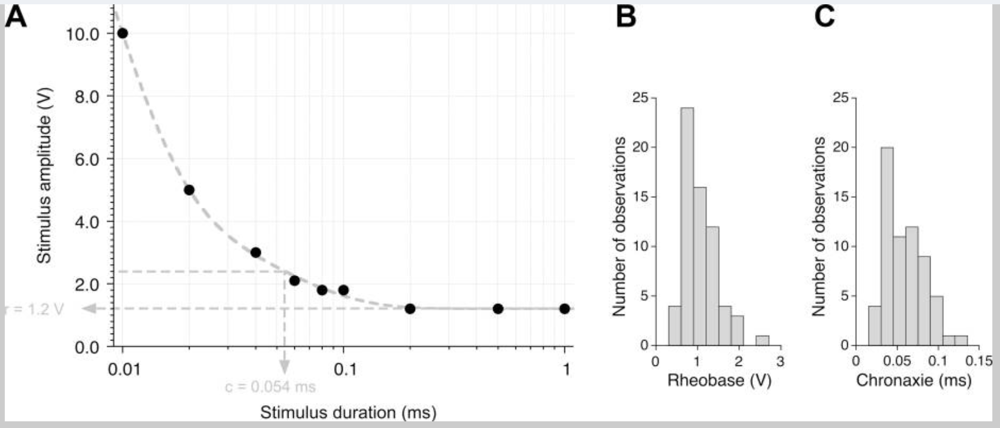
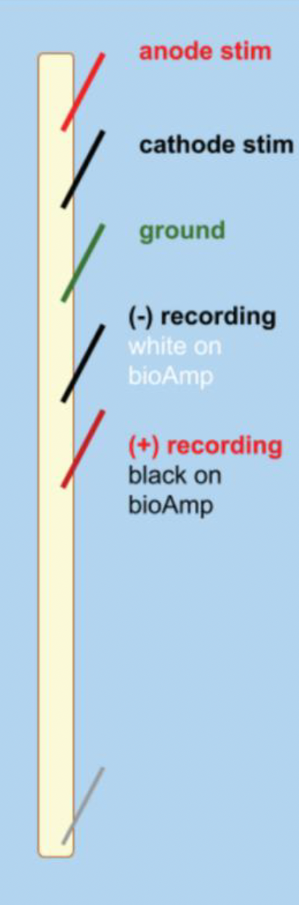

# Earthworm Electrophysiology

## Background & Goals

### Earthworm essentials

Earthworms are a member of the Annelida phylum, which includes segmented worms such as the ragworm and our soon-to-be-friend, the leech. We'll be working with earthworms in the Lumbricidae family.

Earthworms are laid out with a mouth at one end, and an anus at the other. In the middle is the clitellum, a reproductive gland that can secrete a material that helps them form a cocoon. The clitellum is only visible in older worms that are ready to reproduce.

Earthworms have a closed nervous system, with one main blood vessel running down the length of their body. They breathe through their skin, so it is important to keep it moist. They crawl using muscles that are located just underneath the epidermis.

### Earthworm nervous system

Earthworms have a pretty simple brain: it's actually a fused pair of nerve ganglia, mostly located in their third segment. The earthworm has one main nerve cord on its ventral (bottom) side with three fibers running through it: one medial giant fiber, and two lateral giant fibers.

These fibers are big bundles of axons. They serve as high-speed motor pathways that enable the worm to send movement signals throughout its body for quick, stereotyped reflexes.

Each giant fiber is made up of large individual cells (one per segment) that are electrically coupled to each other through gap junctions. This results in the rapid conduction of action potentials from cell to cell so that each giant fiber behaves as though it were a single axon. There are cross-connections between the medial and lateral fibers, so they often function as one unit.

**These fibers differ in important ways.** The medial giant fiber transmits information from skin cells in the anterior (mouth) end of the worm, and the lateral giant fibers transmit information from the skin cells of the posterior end of the worm.

**It's quite easy to listen in to the activity of these large fibers, even from the skin of the earthworm.** Importantly, these fibers fire action potentials very rarely. This type of nervous system activity is often called sparse coding. That means that we should be able to elicit one action potential and cleanly record it.

*Images from [Backyard Brains](https://docs.backyardbrains.com/retired/experiments/speed), © 2009–2026, used under a Creative Commons Attribution-ShareAlike license.*

### Properties of action potentials

In this lab, we'll determine the **threshold**, **rheobase & chronaxie**, **refractory period**, and **conduction velocity** for the earthworm giant fiber system. We're recording compound action potentials (CAPs) from many axons in these fiber bundles, but the underlying principles are the same.

The **threshold** is defined as the minimum stimulus voltage that elicits an action potential 50% of the time. We'll determine this with short stimuli. Stimulus voltages that don't elicit an action potential are called subthreshold; stimulus voltages that do elicit an action potential are called suprathreshold.

In some neurons, we can elicit an action potential with a lower stimulus voltage if the stimulus length is longer. A longer stimulus length enables charge to build up that can ultimately elicit an action potential. However, there is a minimum stimulus voltage needed, even at infinite stimulus durations. The **rheobase** is defined as the minimum stimulus voltage that can elicit an action potential with very long durations of the stimulus. The stimulus duration at 2× the rheobase is called the **chronaxie**. Chronaxie is a useful measure of the excitability of a nerve — the most excitable nerves have the smallest chronaxie. We can plot this data in a strength duration curve: 

The **absolute refractory period** is the minimum amount of time needed for a neuron to fire a second action potential. This is caused by the inactivation of sodium channels after an action potential — it takes time for them to close, to then be reopened by a depolarizing stimulus. Since we're recording from many axons, your measured refractory period will be more variable than for a single axon. We'll define the absolute refractory period as the time when the amplitude of the second CAP is 30% of the first. 

After an action potential, the membrane of the axon is also hyperpolarized, due to the slowness of K⁺ channels closing. So, there is a period of time where the neuron requires more voltage to fire an action potential. This period is called the **relative refractory period**. In this lab, we'll identify it as the period where the amplitude of the second CAP is 30–90% of the first.

**In these experiments you will:**
- Stimulate the ventral nerve cord of the earthworm to elicit an action potential
- Determine the voltage that is needed to recruit the lateral giant fibers
- Estimate the absolute and relative refractory period between action potentials
- Calculate the speed of an action potential
- Propose your own hypothesis about conduction velocity
- Conduct your experiment to test your hypothesis

### References

- Bähring, R. & Bauer C.K. (2014) Easy method to examine single nerve fiber excitability and conduction parameters using intact nonanesthetized earthworms. *Advances in Physiology Education* 38(3): 253–264.
- Bullock, T.H. (1945) Functional organization of the giant fibre system of Lumbricus. *J Neurophysiol* 8:54–71.
- Drewes CD, Landa KB, McFall JL (1978) Giant nerve fibre activity in intact, freely moving earthworms. *J Exp Biol* 72:217-227.
- Kladt et al. (2010) Teaching basic neurophysiology in intact earthworms. *JUNE* 9(1):20-35.
- Rudell & Fox (1991) The Propagation potential: An Axonal response with implications for scalp-recorded EEG. *Biophysical Journal* 60: 556-567.
- Shannon et al. (2014) Portable conduction velocity experiments using earthworms for the college and high school neuroscience teaching laboratory. *Advances in Physiology Education* 38(1): 62-70.

---

## Lab Protocol

There are multiple days dedicated to these earthworm experiments. You are encouraged to complete as many of the experiments below while you have a functioning earthworm.

| **Supplies** | **Cables & connectors** | **Solutions** |
|---|---|---|
| Earthworm| BNC to single banana adapter (2) | Earthworm saline |
| Dissection tray | Banana plug cords (2) | Earthworm anesthetic (10% ethanol in Ringers) |
| PowerLab 26T, connected to computer | Alligator clip adapters (2) | |
| BioAmp | Needle electrodes | |
| Sewing pins (3) | | |
| Ruler | | |
| Thermometer | | |
| Faraday Cage | | |
| Large Petri Dish | | |
| Eyedropper | | |

---

### I. Preparation

#### Setting up the PowerLab 26T

Our first step is making sure our PowerLab & Amplifier are wired up correctly.

Make sure the PowerLab is turned off.

1. **Connect a single BNC adapter to the (+) Output** of the PowerLab. Plug a red banana plug cable into the adapter.
2. **Connect a single BNC to banana adapter to the (−) Output.** Plug a black banana plug cable into the adapter.
3. Make sure that the BioAmp is connected to the PowerLab, with three different needle electrodes plugged into it.
4. Once you're confident everything is connected correctly, turn on the PowerLab.

*Image courtesy of ADInstruments ©*

#### Setting up LabChart 8

1. **Open LabChart 8 with the settings file you saved during the string experiment.** Most settings are saved within this settings file. However, it's always good to ensure that you have the correct settings before beginning.
   > **Note:** If for some reason you cannot access your settings file, you can find one at http://bit.ly/labchart. Use the "Earthworm bioAmp Settings."
2. **Go to Setup > Channel Settings** and confirm that you have three recording channels, and that the third ("BioAmp Recording") is connected to the BioAmp.
3. **Go to Setup > Stimulator** and change the Stimulator settings as follows. Make sure your Marker Channel is Channel 1.

   | Parameter | Value |
   |---|---|
   | Start Delay | 0.1 ms |
   | Repeats | 1 |
   | Max Repeat Rate | 1 Hz |
   | Pulse Height | 0.2 V |
   | Pulse Width | 0.2 ms |

#### Setting up your earthworm

> **Note:** Throughout every step of this procedure, be careful not to stretch the earthworm. This will damage the nerve and your experiment will not work.

1. Obtain a large, lively earthworm. Rinse it with saline if it is dirty.
2. **Anesthetize the earthworm** by placing it in the petri dish with 10% ethanol (in Earthworm Ringer's solution) for 5 minutes.
   > **Note:** Do not leave your earthworm unattended in anesthesia. With too little anesthesia, the earthworm will move around during the experiment, and the resulting muscle electrical activity (electromyogram) will drown out the small neural electrical signals you are interested in. Too much anesthesia and the nerves will not fire.
   >
   > **Note #2:** Your earthworm may still react to pressure after 5 minutes — you can proceed with the experiment as long as you are able to handle the worm and pin it down.
3. **When your earthworm is anesthetized enough to pin it down,** remove the earthworm from the ethanol and place it on the dissection tray with the dorsal (darker side) up.
4. Pin the earthworm to the tray using one sewing pin on each end of the worm.
5. Place the ruler down next to your worm.
6. **Insert a third sewing pin into the anterior end of the earthworm,** ~1 cm from the first pin. Connect the anode & cathode stimulating electrodes to the first two pins.
   > **Note:** The anterior end is the end nearest the clitellum, a smooth, non-segmented band.
7. To keep the worm anesthetized, apply a few drops of the earthworm anesthetic along the length of the earthworm with the eyedropper. Soak up any excess fluid.
   > **Note:** Make sure there isn't a large puddle of solution — too much may interfere with your recording.
8. Insert the three recording needle electrodes into the worm (same configuration as the string experiment!).
   > **Note:** Make sure no wire is touching any other wire. Be careful when positioning the wires to avoid damaging the worm.
   >
   > **Note #2:** It helps to place your recording electrodes as lateral as possible, while still holding down the worm.

---

### II. Determining the threshold of your fibers ★

In this experiment, you will send a stimulus into the earthworm while recording from it to determine the threshold voltage of the medial and lateral giant fibers.

#### Determine the threshold to activate the Medial Giant Fiber

1. **Open your Input Amplifier (BioAmp)** for your Action Potential channel to make sure that your signal looks reasonable. You shouldn't see 60 Hz noise, but it should look like a physiological signal. (If you have noise, see Troubleshooting.)
2. **Open the Stimulator Panel** by going to the Setup menu. Your stimulator should start with:
   - Max Repeat Rate: 1 Hz
   - Pulse Height: 0.2 V
   - Pulse Width: 0.2 ms
   > **Note:** Leave the Stimulator Panel open — we'll need it throughout the experiment.
3. **Press > Start.** LabChart should be in Scope View and display one 20 ms sweep every time you click Start. For each 20 ms sweep, a stimulus pulse is generated through the PowerLab Stimulator outputs.
4. **Examine the recording** — you should see a quick deflection very shortly after your stimulus pulse. The deflection just after the start of the sweep is your stimulus artifact, caused by spread of the stimulus voltage to the recording electrodes.
   > **Note:** The stimulus artifact can be very large in amplitude, and can exceed the range of the recording amplifier. It is okay if it is cut off.
5. **Change the Pulse Height to 1 V.**
6. Each time you change the stimulus, click Start and a new page will appear to the left of the Scope View Window. This is the Page Explorer. **Label the individual pages** of your recording as you go along.
7. **Increase the Pulse Height in 0.1 V steps** until you see an inflection after the stimulus artifact. This means you've successfully elicited a response from the medial giant fiber! Note the stimulus voltage as an estimate of the threshold stimulus strength.
   > **Note:** If you can't see anything, right-click on the channel to change the scaling (or use the − and + buttons on the bottom left of the channel).
   >
   > **Note #2:** If no response is seen with a stimulus of 3.5 V or greater, contact your instructor for assistance.
8. **Find a more accurate threshold** by first reducing the stimulus by 0.2 V (or more) to diminish your response. Then, increase the stimulus by 0.05 V between each sweep. You should report a threshold (Table 1) to the hundredth decimal point (e.g. 1.25 V).
9. Save your data, but do not close the file.

#### Determine the threshold to recruit the Lateral Giant Fibers

In the next stage, you will attempt to elicit an action potential in the lateral giant fibers.

> **Note:** Remember to keep the earthworm anesthetized!

1. Set the Pulse Height to your threshold for the MGF.
2. Keep increasing the stimulus in 0.1 V steps until you see a second inflection in your recorded trace.
3. Once you see a second inflection, follow the same procedure as above to determine the threshold where you can elicit an action potential from the lateral giant fiber about 50% of the time. Record the stimulus threshold in Table 1 below.
4. Save your data, but do not close the file.
   > **Note:** In some worms, the median and lateral fiber responses may not be separated — they will appear to have the same threshold. Other worms may not show the second response, possibly because the lateral giant fibers are damaged.
5. Save your LabChart file.

**Table 1.** MGF and LGF compound action potential (CAP) properties.

| | Threshold | Amplitude | Latency |
|---|---|---|---|
| **MGF** | | | |
| **LGF** | | | |

:::{admonition} Questions for reflection
:class: tip
- Did the shape or amplitude of the CAPs change with more stimulation voltage? What does this tell us about the action potential that is firing?
- Which fiber fires an action potential sooner (with a shorter latency)?
- Why would the MGF and LGF latencies differ?
:::

---

### III. Calculate the rheobase ★

In Part III, we'll change the stimulus amplitude and duration to calculate the rheobase and chronaxie of the earthworm medial giant fiber (read the Background if you forget what these are).

In the previous experiment, we gave a stimulus for 0.2 ms. Now, we'll modify the stimulus duration and amplitude to determine the minimum stimulus requirement, regardless of duration.

1. Write your MGF threshold in the column for 0.20 ms stimulus duration in Table 2.
2. Change your Pulse Height to the threshold for your MGF.
3. Systematically change the duration of your stimulus (Pulse Width) to the values in the table below. As necessary, change the stimulus voltage to successfully get a CAP from your MGF.
4. For each duration, record the stimulus voltage (Pulse Height) values that successfully elicit a CAP in Table 2.
   > **Note:** Be sure to label your pages in Scope view accordingly. You don't need to save the pages that do not elicit an action potential.

**Table 2.** Data for strength-duration curve.

| Duration (ms) | 0.06 | 0.08 | 0.10 | 0.20 | 0.40 | 0.60 | 1.00 |
|---|---|---|---|---|---|---|---|
| Stimulus Amplitude (V) | | | | | | | |

---

### IV. Determine the refractory period

In the next step, you'll determine the shortest time between stimuli where you can elicit two different CAPs from the MGF. In other words, we'll determine the relative and absolute refractory period of these fibers.

1. Set your pulse height so that you can comfortably elicit a response from the MGF.
2. **In Setup > Stimulator, change Repeats to 2** in order to play multiple pulses.
3. We also need to change the time between each stimulus. PowerLab thinks of this interval as Hz. To start, we want 15 ms between each stimulus.
   > **Note:** Remember that Hertz (Hz) means events per second. So, 1 Hz = 1 event per second, and 10 Hz = 10 events per second. 1 ÷ frequency (in Hz) = time between stimuli (in seconds).

:::{admonition} Questions for reflection
:class: tip
- How many milliseconds would there be between each stimulus at 10 Hz stimulation?
- For 15 ms between each stimulus, what should the frequency of stimulation (in Hz) be?
:::

4. Fill out this chart with the corresponding Hz values for each interval length:

| Interval (ms) | 15 | 14 | 13 | 12 | 11 | 10 | 9 | 8 | 7 | 6 | 5 | 4 | 3 | 2 | 1 |
|---|---|---|---|---|---|---|---|---|---|---|---|---|---|---|---|
| Freq. (Hz) | | | | | | | | | | | | | | | |

5. **Change your Max Repeat Rate** to the equivalent frequency for 15 ms intervals.
6. Change your Pulse Width to 0.2 ms and your Pulse Height to the threshold for your MGF.
7. **Press > Start** to record a trial with two stimuli, separated by 15 ms.
8. Right-click and choose **Add Marker > Clamp to Trace** to place a marker at the moment the stimulus occurs. Move your cursor to the peak of the action potential. Look at the ΔV on the right-hand side to see the change in voltage from that point.
9. **Measure the amplitude of your first and second action potentials.** Determine how strong the second was relative to the first (e.g. if AP #2 amplitude was half as high as #1, it would be 50%). Record your response in row one of Table 3.
10. Decrease the duration between stimuli by 1 ms by changing the Repeat Rate to the Hz for a 14 ms interval.
11. **Record the amplitudes and corresponding percentages for each stimulus interval in Table 3.**
12. At some point, AP #2 will diminish below 30% of AP #1. We can consider this our absolute refractory period.
    > **Note:** Depending on the latency of your MGF CAP, it may be difficult to see a CAP with a stimulus interval of 1 or 2 ms. Reduce the stimulus interval to as short as you can before the MGF CAP is cut off by the second stimulus. If the shortest stimulus interval is >3 ms, you should move your pins closer together.
13. Save your LabChart file.
    > **Note:** If you have data that doesn't seem quite right, you should repeat your experiment. You must be upfront about your number of repeats in your lab report, comprehensively reporting all of the data that you collected.

**Table 3.** Amplitudes of CAPs elicited by stimuli with decreasing stimulus intervals.

| Stimulus Interval (ms) | #1 CAP Amplitude | #2 CAP Amplitude | % #2/#1 |
|---|---|---|---|
| 15 | | | |
| 14 | | | |
| 13 | | | |
| 12 | | | |
| 11 | | | |
| 10 | | | |
| 9 | | | |
| 8 | | | |
| 7 | | | |
| 6 | | | |
| 5 | | | |
| 4 | | | |
| 3 | | | |
| 2 | | | |
| 1 | | | |

:::{admonition} Questions for reflection
:class: tip
- What was the shortest duration between stimuli where the second action potential was less than 90% but more than 30% of the original CAP amplitude?
- What was the shortest duration between stimuli where the second CAP was diminished below 30%?
- Which of these values is your absolute refractory period, and which is the relative refractory period?
:::

---

### V. Compute the conduction velocity ★

*(If you're doing this on a different day, follow the same steps for preparing LabChart & your earthworm as you did in the previous earthworm experiment.)*

**How far is your first recording pin (−) from your cathode (−) stimulation pin? Be sure to include units:** ______________________

1. **In PowerLab, press Start.** Confirm that you have two recording channels.
2. Follow the same protocol as in the previous experiments to determine the threshold required to elicit an action potential from your medial giant fiber.

**What is the stimulus voltage needed to elicit an MGF action potential from this worm?** ______________________

#### Determine the MGF latency to spike

1. Using the Marker tool, measure the latency (in seconds) from the peak of the stimulus artifact to your elicited action potential.
2. Repeat this 5 times and record your data in Table 4.

**Table 4.** MGF conduction velocity data.

| Trial | MGF Baseline Latency (s) | Speed (m/s) | MGF Experimental Latency (s) | Speed (m/s) |
|---|---|---|---|---|
| 1 | | | | |
| 2 | | | | |
| 3 | | | | |
| 4 | | | | |
| 5 | | | | |

3. Since we know when the AP occurred and the distance between your electrodes, we can calculate the speed of the action potential. Record these values in the "Speed" column of the table above. *(Reminder: speed = distance/time.)*

**How fast, on average, is your action potential traveling down the MGF?** ______________________

---

### VI. Design your own experiment to test the impact of temperature on MGF conduction velocity 
For this final part, you will design your own experiment to test the impact of temperature on conduction velocity. We will provide ice and a thermometer, but the rest is up to you! If you are performing this experiment on a separate worm, be sure to measure the threshold for the MGF as described above.

Work with your group to determine a protocol for running your experiment — you’ll need to include this in the Methods section of your lab report. Think about what someone needs to know in order to replicate this experiment exactly as you did.

We will test the effect of ______________________________ on ______________________________.

We will do this by...

#### Conduct your experiment

Work with your group to determine a protocol for running your experiment — you'll need to include this in the Methods section of your lab report.

Record your results in the MGF Experimental AP Latency column of Table 4. You'll need these later for the Results section of your lab report.

---

### Troubleshooting

| Observation | Likely issue | Possible solution |
|---|---|---|
| The recording trace is flat | Something is disconnected | Check all of your connections |
| I can't see a stimulus trace in the Stimulus channel | You don't have a marker channel set up | Go to Setup > Stimulator to set up the Marker Channel |
| I can't see a stimulus artifact in my action potential channel | Your electrodes may not be in the worm, or stimulus amplitude is too weak | Ensure all electrodes are in the worm (but not too medial), and try stimulating at 0.5 V |
| My worm is bleeding | The electrode is through the blood vessel | Move the electrode more lateral; if you don't get an AP after this, get a new worm |
| There is a stimulus artifact, but no visible response to stimuli between 1–3 V | Your electrodes may not be placed well, or your worm may be damaged | Try to reposition the electrodes on a different place in the worm. If this doesn't work, get a new worm. |
| My recording just looks like a big up and down squiggle (like a sine wave) | You're picking up 60 Hz noise | Ground everything (Faraday cage, ground recording pin, amplifier) to the ground pin on the back of the PowerLab. Averaging multiple trials can also get rid of noise. |

---

### Possible opportunities for student projects

- Application of chemicals, nerve blockers, etc. to test for effects on the nervous system
- Earthworm dissection & recordings (as in Gunther, 1976 or 1972)
- Demonstrating facilitation of conduction rate (Bullock, 1951)
