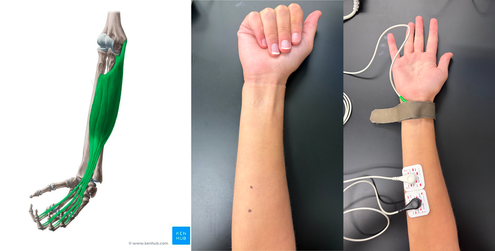

# Lab Orientation
## Meeting Your Tools: PowerLab, LabChart, and Your First Signal (EMG)

:::{admonition} Today's guiding question
:class: tip
How does a physiological signal — something happening inside a living body — become a number and a picture on your screen?
:::

By the end of today you will have:
1. Located and connected the physical hardware (PowerLab + adaptors + electrodes)
2. Recorded a real signal (EMG) using LabChart
3. Located and learned the purpose of key functions in LabChart.

**As you work through the lab activities, complete the scavenger hunt tasks:**

* 📸 Take a photo or screenshot.

* ❓ Discuss with your teammates.

If you get stuck, refer to the [Student LabChart Guide](https://cdn.adinstruments.com/adi-web/manuals/LabChart7_1_QRG.pdf).

---

**Supplies**
* LabChart & PowerLab
* DIN8-BNC adaptor
* Single female banana plug BNC adaptor
* Banana cable
* BioAmp cable
* Shielded Lead Wires (3 Snap-on)
* Disposable electrodes (2)
* Nuprep abrasive gel
* Alcohol pad
* Marker

## Part 1: Hardware & Software Scavenger Hunt

### **1A: Setting up LabChart 8**

LabChart 8 is the software we’ll be using to record electrophysiology data. Before performing our experiment, we need to set up LabChart to acquire and display the data as we want.

1. Turn on the PowerLab 26T. *You should see a green blinking light. If you don't see this light, what's the first thing you should check?*

2. Open LabChart 8. You should see that the PowerLab is connected with a green check mark.

3. Open a new experiment by choosing the New button (bottom left-hand corner).

4. By default, LabChart prepares to record from too many channels, which crowds the screen. We need to decide how many channels to record. Go to Setup > Channel Settings.

  *   At the bottom of the window, change Number of Channels to 1, and make sure that it is on (box on the left is checked).

  *   Rename the channel “Raw Recording”.
  *   Click OK

> 📸 **Take a photo/screenshot of LabChart configured as described**

### **1B: Identifying Hardware**

1. Identify the four "Input" ports on the PowerLab.

2. Find the Cables & Connections Cheat Sheet hanging on the wall near your bench.

>  📸 **Take a photo of the Cables and Connections Cheat Sheet** with the actual cables and connections in your toolbox next to their portraits.

3. Connect a DIN8-BNC adapter to Input 1 of the PowerLab.

:::{admonition} Be careful with our equipment!
:class: danger
The DIN8 pins are small and fragile. When plugging in the DIN8 and when attaching cables, do NOT twist the DIN8.
:::

4. Attach a single female banana plug BNC adaptor to the DIN8-BNC adaptor.

:::{admonition} BNC, twist it please!
:class: danger
The BNC cable uses a twist-lock mechanism, and must be turned 90 degrees to lock into the port. Be careful to avoid twisting the DIN8 when doing so.
:::

5. Plug in a banana cable to the adaptor.

>  📸 **Take a photo of the front of your PowerLab in this configuration.**

### **1C: Finding sources of electrical noise**

1. Hold the lead (the end of the banana cable) in your hand.

2. In the Channel Settings window, click on Input Amplifier for Channel 1. The Input Amplifier window will show the voltage that you’re recording. This allows for precise setting of the input range for a recording channel and provides filtering options.

3. The signal at your rig may be variable. To adjust the sensitivity of the channel, choose an appropriate range setting from the Range drop-down list in the Input Amplifier dialog.

:::{admonition} Understanding range
:class: tip
The number displayed in the range menu indicates the maximum input voltage currently selected. Notice how as you decrease the range the vertical scale changes and the small rhythmic deflections that appear on the signal trace increase in amplitude.
:::

4. Choose a range such that your signal fills about ⅔ of the window.

5. Observe the change in the recorded voltage with the electrode lead held overhead (near the lights) and then near the ground (away from the lights).

> 📸 **In the future, we'll ground noisy signals by directing them into a grounding post. Take a photo of the grounding post on the back of your PowerLab**

:::{admonition} Can't find your ground post?
:class: tip
*See the labeled schematic on page 2 of the Student Guide for help: https://cdn.adinstruments.com/adi-web/manuals/LabChart7_1_QRG.pdf*
:::

:::{admonition} A future of Faraday cages
:class: tip
In the future, we'll also address noise using a Faraday cage, a large mesh metal cage used to ground your electrophysiology rig.
:::

6. Adjust the horizontal scale (the small and large mountain icons) to manually zoom on on the recorded signal so you can see 0.1-0.2 seconds of the recording. Count the number of peaks (or troughs) in 0.1 second.

> 📸 **Take a photo of ~0.1 seconds of the recording from the banana cable “electrode.”**

> ❓**What is the frequency, where 1 Hz = 1 cycle/second, of this noise?**

## Part 2: Recording EMG Signals

**We encounter two problems when recording from nervous systems:**
1. Signals are very small
2. The environment is noisy

An amplifier can amplify biological signals, so that we can record them amongst the noisy environment.

Here, we'll use a BioAmp to amplify extracellular signals in BIPN 145. **Extracellular recordings** detect electrical signals from outside cells, and usually are used to record signals from many cells at once. For example, we can use extracellular electrodes to record electrical signals from skeletal muscle fibers as they depolarize and contract. This technique is called **electromyography (EMG)**. Surface EMG is a safe, non-invasive technique to record the activity of skeletal muscles using electrodes placed directly on the skin.

In this abbreviated experiment, you'll use EMG to record signals from the flexor digitorum superficialis (FDS), a muscle involved in handgrip.

### **2A: Setting up the BioAmp**

1. Turn off the Powerlab and close out of LabChart

2. Remove all of the cords from the PowerLab and disassemble the parts before returning them to their original location. To earn professionalism points in this class, you'll need to return all materials to their original locations, in their original condition.

> 📸 **Take a photo of your toolboxes, with the parts returned to their original locations**

3. Connect the BioAmp to the PowerLab. *Ensure the notch on the BioAmp port lines up with the notch on the cable*

4. Turn the Powerlab back on and open a new LabChart file.

5. Change the configuration of your recording so that you are now using the BioAmp:

   * Go into Setup > Channel Settings.

   * Find the channel that lists the BioAmp under the Input Amplifier column.

   * Rename that channel to “BioAmp Recording.” and uncheck all other channels.

### **2B. Setting up your EMG electrodes**

(Left) Anatomy of the flexor digitorum superficialis (FDS) muscle (image © Kenhub). (Middle) Identifying the FDS muscle: with your arm resting on your lab bench, palm up, close only your first four fingers (not the thumb). You'll see a bump when the FDS muscle flexes; mark this location as shown. (Right) Electrode placement on the FDS muscle. The white negative electrode is placed near the wrist, and the black positive electrode is placed closer to the elbow. The green ground electrode is attached to the velcro wrist-strap.

1. Remove any jewelry from the volunteer’s hand and arm. Use the marker in your toolbox to mark two
small crosses 2-3 cm apart on the skin above the flexor digitorum superficialis (use the figure above as a guide). Abrade the skin with abrasive NuPrep gel. This is important as abrasion helps reduce the skin’s resistance. After abrasion, clean the area with an alcohol pad to remove the dead skin cells.

2. While the skin is drying, attach the Shielded Lead Wires to the Bio Amp Cable: Use the bottom three inputs (NEG, POS, EARTH) and follow the color scheme on the BioAmp cable. Attach the disposable snap-on electrodes to the end of the negative and positive wires.

3. Put the snap on electrodes and velcro grounding strap on the volunteer. The negative electrode is placed closest to the wrist, and the positive electrode is placed on the belly of the FDS muscle. The Earth (green) will be connected to the velcro grounding strap. Refer to the figure above as a guide.

:::{admonition} Trouble grounding?
:class: tip
If you have trouble getting a proper ground connection with the wrist strap, you can
also directly attach a Disposable Electrode and place the ground at the wrist.
:::

### **2C: Recording EMG Signals**

1. Have the volunteer sit in a relaxed position with their elbow bent 90 degrees and palm facing upward. Make sure the volunteer’s elbow is not on the table and the volunteer is facing away from the monitor.

2. Open Chart View on LabChart and click Start to begin recording.

3. Have the volunteer make a light contraction of the FDS muscle. This is done by gently bending the first four fingers (exclusing the thumb) in a "one handed clap" motion. Hold the movement for 3 seconds.

4. Repeat step 2, but this time try to make the EMG signal larger in amplitude.

> ❓**How can you increase the amplitude of your EMG signal?**

5. Click Stop to pause your recording.

> 📸 **Right click to Autoscale your signal and take a photo**

> ❓ **Identify the buttons that you can use to change the time scale on your recording and draw a sketch of them.**

6. Chart View displays data in a continuous recording, while Scope View allows you to record discreet sweeps of data. Select Scope View from the Window panel on the top of your screen

> 📸 **Set the sample duration to 5 s. Take a photo of the window in LabChart where you can set the sample duration**

7. Record 3 5-second sweeps of data and name each page in Scope View. We recommend unchecking the "Overlay" box on the top left, so you only see one recording at a time.
* Relaxed
* Gentle fist
* Clenched fist

> 📸 **Take a photo of the three named recordings.**

8. In the Clenched Fist recording, drag the Marker Tool on the bottom left corner (or right click, "Set Marker) to the peak of the highest EMG waveform. You may need to zoom in manually to place the marker. Move your cursor along the trace and look in the top right corner for the Δ output, which calculates the difference in voltage and time between your cursor and the Marker tool.

> 📸 **Use the Marker Tool to measure the height of your largest EMG wave from peak to trough. Take a photo.**

9. Return to Chart View and start recording again. We're going to play with the parameters that determine the range and frequency of our signal sampling.

> ❓ **Identify two places in LabChart where you can set the Range of your recording**

> 📸 **Adjust the range so your signal goes "out of range". Take a photo of your signal.**

> 📸 **Reduce the sampling rate of your recording to 20/s and take a video of your recorded trace**

> ❓ **What happens when sampling rate is slower than the frequency of your physiological signal?**

> 💬 **Before cleaning up and closing out of LabChart, let your instructional team know you are done. They'll ask you to show them a random selection of the scavenger hunt tasks. If you have any questions about the lab course or today's activities, please ask!**  

---

*Written by staff of ADInstruments, edited by A. Juavinett, M. Marino, and I. Maita
Copyright © 2015 ADInstruments Pty Ltd. All rights reserved. PowerLab® and LabChart® are registered trademarks of
ADInstruments Pty Ltd. The names of specific recording units, such as PowerLab 8/30, are trademarks of ADInstruments Pty Ltd.
Chart and Scope (application programs) are trademarks of ADInstruments Pty Ltd. www.ADInstruments.com*
