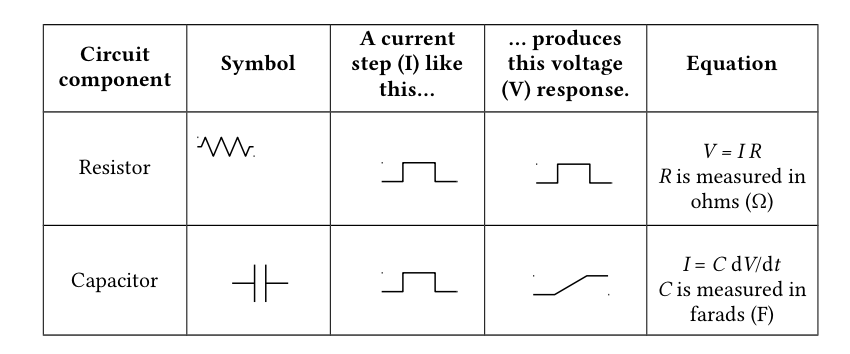

# Modeling Neural Membranes

## The brain as a circuit board

We often describe the brain in terms of circuits, which is a useful and pretty accurate metaphor. In our Modeling Neural Circuits lab, you'll encounter two different ways to model the brain: using an online simulator and with a physical simulation on a breadboard. Both use the fundamental concepts of how electricity flows through substances to generate a working model of the biophysical properties of a neuron.

This introductory page will provide some background information to help you navigate the concepts of this lab.

## Modeling resistance
A resistor converts electrical energy into heat when current flows through it. A current flowing through a resistance creates a voltage drop across that resistor, described by Ohm’s law:

:::{admonition} Ohm's Law
:class: note
**V = IR**

| Symbol | Meaning |
|---|---|
| V | voltage (Volts) |
| I | current (Amps) |
| R | resistance (Ohms,  Ω) |
:::

In a neuron, the resistance is determined by the opening and closing of ion channels, which allow current to flow in and out of the cell. When more ion channels are open, more ions are able to flow. Ion channels can be represented with resistors in an RC circuit, since they resist the flow of electricity. 

It’s important to note the units in the equation above: 1 Amp flowing through a 1 Ohm resistor produces 1 Volt across the resistor. In electrophysiology, we typically work with different scales of numbers:

| Unit | Equivalent |
|---|---|
| millivolts (mV) | 10⁻³ V |
| nanoamps (nA) | 10⁻⁹ A |
| megaohms (MΩ) | 10⁶ Ω |

Sometimes you’ll see Ohm’s Law with conductance instead of resistance. Conductance (measured in siemens and often denoted by g) is the inverse of resistance. In other words, it’s equal to 1/R.

### Kirchhoff’s circuit laws

:::{admonition} Kirchhoff's Laws
:class: note
Kirchhoff’s laws state two relatively intuitive facts:
1. **The voltage at a given point in a circuit is uniquely defined.** Thus, if there are two (or more) paths to go from point A in a circuit to point B, the voltage drop along each of those paths is the same.
2. **The voltage drops around a closed loop must sum to zero.** The sum of all currents going into a point equals the sum of all currents going out of it.
:::

## Modeling capacitance
Capacitors are defined by two conducting substances separated by a non-conducting substance in the middle. Capacitors accumulate electric charge on the insulator. The accumulated charge creates an electric field between the conductors and stores electrical energy. Salty fluids that make up the intra- and extracellular solutions of the cell are conductive, the lipid bilayer is not. Therefore, the neural membrane acts as a capacitor. 

To summarize and add a couple useful symbols:

## Modeling concentration gradients
In a neuron, there’s also a steep concentration gradient due to the different concentrations of ion on either side of its membrane. This is the basis of the neuron’s resting potential. The inside of the cell is more negative than the extracellular cell space -- typically by about -60 mV, depending on the cell type. We’ll use batteries to model this offset of voltage.

## Putting it all together
With these components – resistors, capacitors, and a battery – current flow in a neuron can be modeled. In reality, there are many different ion channels, and multiple different ion conductances. We’ll simplify each of these into one membrane resistance, and we’ll model the membrane of the cell with one capacitor.

When we send current into a circuit with a capacitor, the capacitor will charge. In both a neuron and an electrical circuit, voltage rises to a steady state level asymptotically in the response to an external current (e.g., from an action potential or passively passing charge). Once the external current is shut off, the voltage drops in a similar asymptotic way. As you’ll discover today, this charging time course depends on a few different factors. 

These characteristics of the membrane voltage can be measured with a simple voltmeter in the RC circuit. Opening more ion channels (or resistors, as in this RC circuit), which decreases resistance and increases conductance, will express a more rapid increase in voltage on the voltmeter, visually demonstrating the properties of resistance in a neuron.

We can calculate a time constant, which represents the time it takes to reach a steady state after a change in voltage across the membrane:

:::{admonition} Time Constant
:class: note
**τ = RC**

| Symbol | Meaning |
|---|---|
| τ | time constant (seconds) |
| R | resistance (ohms) |
| C | capacitance (farads) |
:::

## Breadboards & electronics are useful tools for neuroscience research

Lastly, these types of circuits are really useful for designing neuroscience experiments. Many labs rely on breadboards and microcontrollers (e.g. Arduino) to create custom setups. Once you know how to wire up a circuit and program an Arduino, you can do pretty much anything.

This video will explain how to complete the activities in our lab on a breadboard:

<iframe width="560" height="315" src="https://www.youtube.com/embed/qPSuzXQk2Qs" title="YouTube video player" frameborder="0" allow="accelerometer; autoplay; clipboard-write; encrypted-media; gyroscope; picture-in-picture" allowfullscreen></iframe>