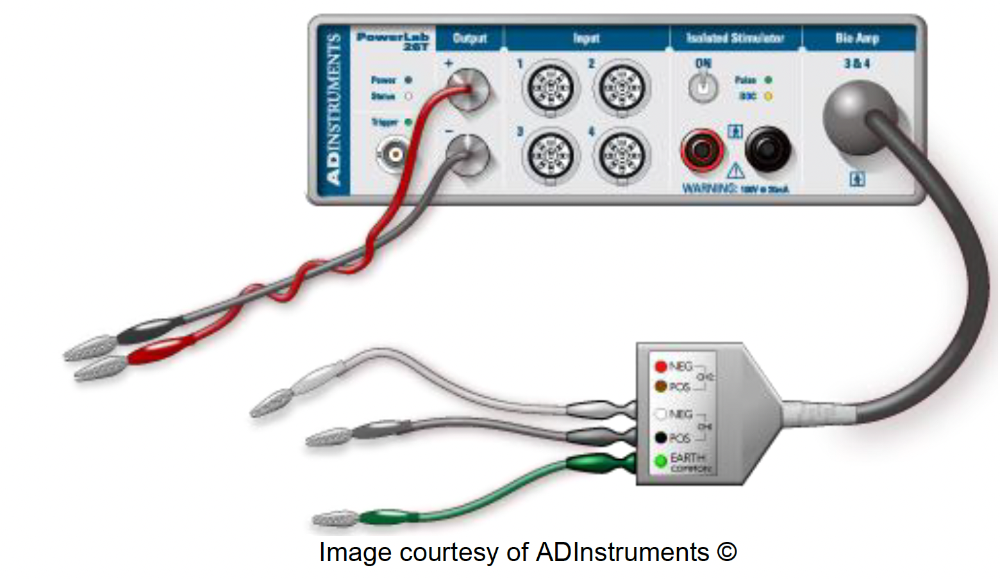

# Lab #1: String Nervous Systems

## Background & Goals

### Why are we recording from a string?

The purpose of this lab is to get familiar with the recording equipment and software that we'll be using in this course.

First, we'll learn how you can configure LabChart 8 to acquire data and send out pulses of electricity. Then, you'll record the **stimulus artifact** (the passively conducted signal from the stimulus) from a saline-soaked piece of string. The string mimics some of the properties of the earthworm that you'll observe in a future experiment. This will give you the opportunity to learn how to use the stimulating and recording devices on the PowerLab, as well as reduce noise and stimulus artifacts from your recordings, before you actually have to do all of this in an experiment.

Asking questions during this lab is a great idea, and will help you succeed in future experiments.

### Pre-Lab
Before the lab, watch this video and read the protocol below:

```{raw} html
<iframe width="600" height="338" src="https://www.youtube.com/embed/zjLx6uhlYSM" frameborder="0" allow="accelerometer; autoplay; clipboard-write; encrypted-media; gyroscope; picture-in-picture" allowfullscreen></iframe>
```

---

**Today you will:**
- Configure a recording experiment in LabChart 8.
- Determine how to record signals from a string.
- Identify sources of electrical noise in your rig.

*This lab was adapted from Experiment #1 from the BIPN 105 & BIPN 145 Lab Manuals, as well as AD Instruments.*

---

## Lab Protocol

| **Supplies** | **Cables & connectors** | **Solutions** |
|---|---|---|
| String | BNC to single banana adapter (2) | Saline |
| Dissection tray | BNC to double banana adapter | |
| PowerLab 26T, connected to computer | BNC to DIN8 adapter | |
| BioAmp | Alligator clip adapters (2) | |
| Sewing pins (2) | Banana plug cords (2) | |
| Faraday Cage |  | |
| Large Petri Dish | | |
| Eyedropper | | |


## I. Setting up LabChart 8

LabChart 8 is the software we'll be using to record electrophysiology data. Before performing our experiment, we need to set up LabChart to **acquire** and **display** the data as we want.

1. Turn on the PowerLab 26T.
2. Open LabChart 8. You should see that the PowerLab is connected with a green check mark.
3. Open a new experiment by choosing the **New** button (bottom left-hand corner).
4. First, we need to decide how many channels to record. Go to **Setup > Channel Settings**.
   * At the bottom of the window, change the number of channels to **3**, and make sure that they are all on (box on the left is checked).
   * Rename the first channel **"Stimulus"** and the second channel **"Raw Recording"**.
   * Set the range for Channel 1 (your "Stimulus" channel) to **5 V**.
   > **Note:** The range determines the range of values the PowerLab will record, and when using the BioAmp (later in this lab), it will actually change the amplification.
   * Set the range for Channel 2 (your "Raw Recording" channel) to **100 mV**.
   * Make the sampling rate for Channel 1 **"40k/s"** and ensure that *"Same sampling rate for all channels"* is checked.
   * Make sure that the far-right column says **"No calculation"** for all three channels.

## II. Finding sources of electrical noise

One of the biggest issues in electrophysiology is noise from overhead lights and other electronics in the room. It'll help to get an understanding of where noise in your rig is coming from.

1. Connect a DIN8-BNC adapter and a double 3-way BNC adapter to **Input 2** of the PowerLab. Plug in a red banana cable to the positive (red) side of the connector.
2. Hold the lead (the end of the banana cable) in your hand.
3. In the Channel Settings window, click on **Input Amplifier** for Channel 2. The Input Amplifier window will show the voltage that you're recording. This allows for precise setting of the input range for a recording channel and provides filtering options.
4. The signal at your rig may be variable. To adjust the sensitivity of the channel, choose an appropriate range setting from the **Range** drop-down list in the Input Amplifier dialog.
   > **Note:** The number displayed in the range menu indicates the maximum input voltage currently selected. Notice how as you decrease the range the vertical scale changes and the small rhythmic deflections that appear on the signal trace increase in amplitude.
5. Choose a range such that your signal fills about ⅔ of the window.
6. Observe the change in the recorded voltage with the electrode lead held overhead (near the lights) and then near the ground (away from the lights).
7. Try the lead inside of your Faraday cage. Is the signal more or less noisy?
   > **Tip:** Is your Faraday cage actually grounded? How could you ground it?

:::{admonition} Questions for reflection
:class: tip
- How does the signal change as you move the electrode lead around?
- What do these sources of noise mean for our recording configuration, and our attempts to record electrical activity?
:::


## III. Recording stimulator outputs

We'll use our PowerLab as a stimulator that can send voltage pulses into our specimen. We can change the timing, shape, amplitude, and repetition of these stimuli via the Stimulator window in LabChart. We'll directly record these stimuli by sending the output of the PowerLab into an input.

1. Change your view to **Scope view**, which looks like the sweeps of an oscilloscope. The advantage of Scope View is that it allows the overlay and averaging of your data.
2. In Scope view, set the **Duration** to **20 ms**. This changes how long each sweep of data is.
3. Remove the DIN8-BNC adapter & cable from Input 2.
4. On the PowerLab, connect the **(+) Output** to **Input 1** using the BNC to DIN8 cable.
5. Go to **Setup > Stimulator** to open the Stimulator window. This is the window where you can modify the shape, timing, and amplitude of the stimulus output.
6. Make sure that the **Waveform Name** is set to **Pulse**.
7. Change the range of the Pulse Height to **-5 to 5 V** by clicking the ruler button next to the Pulse Height option.
8. Configure the following by clicking and then editing the values in the window:

   | Parameter | Value |
   |---|---|
   | Start Delay | 1 ms |
   | Pulse Width | 0.1 ms |
   | Pulse Height | 0.150 V |

9. Close the Stimulator window.
10. Go to **Setup > Stimulator Panel** to open a smaller window where you can directly modify the stimulus. This window can stay open while you're recording.
11. Press **> Start** in the main LabChart GUI.
12. Increase the stimulator voltage (Pulse Height) and watch the level change in the window.
13. Try a negative stimulus voltage.
14. Open the Stimulator window again and vary the delay, duration, and waveform shape, and see what happens. If your recording is cut off, how can you fix it? *(Hint: see Visualization tips in Meet Your PowerLab.)*

:::{admonition} Questions for reflection
:class: tip
- Why would you want to record the stimulus output?
- Why would you want to delay the stimulus output?
- Why would you want to send different shapes of waveforms?
:::

---

## IV. Recording the stimulus artifact

Lastly, we'll add an amplifier (the BioAmp) to our circuit, and use this to record from a string soaked in saline. The string doesn't have a nervous system, but we'll add some voltage with our stimulator and observe the change in voltage from another point on the string.

### Set up your string stimulation experiment

Your setup for the string stimulation will look like this:



1. Remove all of the cords from the PowerLab.
2. Connect your two single BNC to banana cable adapters into the **(+)** and **(-)** Outputs of the PowerLab.
   > **Note:** The color of these does not matter, but it can help to be consistent — red for the anode (+ Output) and black for the cathode (- Output).
3. Using banana cables, connect the **(+) Output** to your **anode** stimulating electrode (the sewing pin) and the **(-)  Output** to the **cathode** stimulating electrode.
4. Connect the BioAmp to the PowerLab.
5. Connect the (+) recording, (-) recording, and ground needle electrodes to your string and into the corresponding spots on the BioAmp.
   > **Note:** The colors on the BioAmp defy convention — consult the diagram above for clarity.
6. Change the configuration of your recording so that you are now using the BioAmp:
   - Go into **Setup > Channel Settings**.
   - Make sure that **BioAmp** is listed under the Input Amplifier column for Channel 3.
   - **Uncheck** Channel 2 — we don't need to record from it anymore.
   - Change the name of Channel 3 to **"BioAmp Recording."**
7. We've removed our ability to directly record the stimulus output, so we need another way to know when the stimulator sends outputs. Open the Stimulator Settings and set the **"Marker Channel"** to Ch1 (your "Stimulus" channel). With this setting, LabChart will put a small tick on Channel 1 to show you when the stimulus was sent.
   > **Note:** This marker tells you *when* the stimulus was sent, but does not indicate the height or length of the stimulus. This means you need to label your pages with your stimulation parameters.


### Stimulate your string!

:::{image} images/string_electrodes.png
:width: 150px
:align: center
:::

1. Place your string in saline in the small petri dish, and give it a few minutes to soak. If it's not completely soaked, you will not get a stimulus artifact.
   > **Note:** If your string dries out during the experiment, you can use an eyedropper to add saline to it.
2. Lay the string out on the dissection tray, with the stimulating and recording electrodes laid out as in the diagram above.
3. Set the stimulator voltage to **1 V**, and press **> Start**. You should see your stimulus recording on Channel 1, as you did before, but you should also now have a recording on Channel 3 (BioAmp Recording).
4. Change the scaling if you cannot see the entire deflection.
5. If you do not see anything, increase the voltage (no more than 5 V).
   > **Note:** This recorded deflection is called the **stimulus artifact**. This artifact can exceed the range of our amplifier. Recovery from the artifact should be rapid, however, so that the baseline is reached within one millisecond or so after the stimulus pulse.

:::{admonition} Question for reflection
:class: tip
Is the amplitude of the stimulus artifact the same as the amplitude of the stimulus? Why or why not?
:::

6. Increase the stimulator voltage, and stimulate again. What happens?
   > **Note:** Change the name of Scope pages, or make comments on the recording, to indicate what you've done during that run of the stimulus. You need to know the metadata for the experiment once you're ready to export.
7. Change the stimulus to a **negative voltage**, and stimulate again. Does the stimulus artifact change?
8. Choose one of your pages where you have a stimulus artifact with a clear peak. Using the **Marker tool**, measure the latency from the stimulus to the beginning of your artifact. How much of a delay is there? How much of a delay *should* there be? (How fast does an electrical current flow?)
9. Change the location of the stimulating electrodes. How does this change the shape of the artifact?
10. Remove the ground electrode. How does this change your recording?

### Save your file & export your data

LabChart buffers files to disk in case of a power failure or computer crash, but it's wise to save work frequently. Saving files in LabChart is the same as saving any file on your personal computer.

Please backup your LabChart data files to the Google Drive you set up at the start of the quarter.

1. Save the **settings file** for your experiment by going to **File > Save As Settings File** in LabChart. Save it in a safe place (not locally on the computer). You will need this settings file for the earthworm experiment.
2. Save the **data file** for your experiment by going to **File > Save As** and save as a LabChart Data File (*.adicht*).
3. Go to the Scope page for **two of your favorite string stimulation experiments** that you can compare and contrast — for example, two different voltages, or with two different distances between the stimulator and recording electrodes.
4. Follow [these instructions for exporting your data](https://bipn145.github.io/LabChart/ExportingLabChart.html).
5. Plot your recordings (separately or on the same axes — be sure to label two different recordings if overlaid). Make sure your axes are labeled with units. You can create these plots in [Python](https://bipn145.github.io/LabChart/ImportingPython.html) or [Excel](https://bipn145.github.io/LabChart/ImportingExcel.html).
6. Copy your plots into a Word or Google document.
7. See your instructor's Canvas assignment for detailed directions about what else you need to submit.

---

### Troubleshooting

| Observation | Likely issue | Possible solution |
|---|---|---|
| You can see the stimulus marker on Channel 1, but no stimulus artifact on Channel 3 | Your string may not be soaked in saline well enough | Add saline to the string |
| The recording trace is cut off | Your visualization needs to be re-scaled, or your range is too small | Right-click on channel and choose Auto Scale (see Visualization tips above); change the range on your recording channel |
| Your string recording trace has clear 60 Hz noise | You're not grounded, or there are ground loops | Make sure your Faraday cage and ground electrode are both grounded to the back of the PowerLab. If this doesn't help, consult an instructor. |
