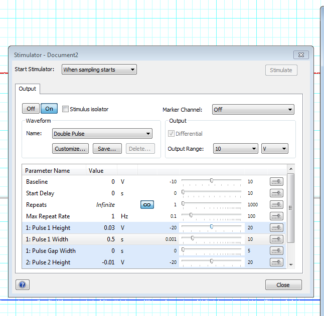

# Filling the Retzius Cell

In this final leech lab, you'll fill the cell you recorded from with a fluorescent dye so that you can visualize its structure under the microscope.

## Additional Supplies

- Glass slide & coverslip
- Glycerol
- Bulb & glass pipette
- Small vial of either Alexa Fluor 488 (green) or Alexa Fluor 594 (red) conjugated dextran dye (5% in dH₂0)
- Phosphate buffer (PB)
- 2% Paraformaldehyde (PFA) in 0.1 M PB
- Waste containers (2)

## I. Preparing Your Experiment

First, we have to prepare an electrode that has dye in the tip. These dyes diffuse well through cells and will latch onto proteins when we fix the ganglia.

We'll use one of two dyes: an Alexa Fluor 488 dextran (green), or an Alexa Fluor 594 dextran (red). If you have time today, you are welcome to fill more than one cell to compare two neurons.

1. You'll be given a small vial with dye in it.
2. Place your glass pipette with the back end (the non-sharp end) into the small vial. The dye will be wicked along the fiber inside of the pipette.
3. Hold the pipette there for ~1–3 minutes until you can see traces of dye in the sharp tip of the glass pipette.
4. Remove the pipette from the small vial of dye.
5. Using the syringe, fill the pipette with 3M KCl solution. Leave a small gap (3–5 mm) of air between the dye and the KCl.
6. Carefully attach your glass pipette into the gold microelectrode holder by sliding the metal wire into the pipette, pressing firmly, and screwing it tight. Make sure that the pipette is not going to fall out of the holder.
7. Attach the pipette holder to the head stage.

### Checking the resistance of your electrode

**Note:** For this experiment, you need to check the resistance, but you do not need to balance the bridge.

Measure the resistance of your electrode by following the steps in the previous lab protocol. In the same way, use Ohm's law to calculate the electrode resistance. The resistance with the dye will be higher than before, but should still not be higher than 100 MΩ.

**Electrode resistance = ______________________**

If your resistance is higher than 100 MΩ, try the Ringer button to clear it. If this doesn't work after several tries, get a new pipette.

### Configuring LabChart & stimulus pulses

**Note:** While someone in your group is configuring the stimulus pulses, another group member should move onto Part II: Impaling a neuron.

Your configuration for LabChart will look similar to our leech recording session. Before we impale a cell, we'll also configure our pulses to look like this:

LabChart will tell the amplifier to send 1 nA for each 10 mV of stimulus given. Calculate the stimulator voltage we need for 1 and 3 nA and record above.

1. Open a new experiment in LabChart with the Leech Experiment settings.
2. Open the Stimulator window (Setup > Stimulator).
3. Change the wave type to "Double Pulse" setting in the Stimulator.
4. Set the parameters of your stimulus using the diagram below:

   

   **Hint:** The waveform above is one positive pulse immediately followed by a negative pulse. You may need to change the possible range of these parameters before you can modify them to your needs.

   **Note:** Change the Pulse Width of the second stimulus based on the diagram above. You can click on "Customize" to reassure yourself that you've configured the stimulus correctly.

5. Close the window when you're done.

#### Optional step: Directly monitor your stimulus waveform

To confirm that you've configured your stimulus correctly, you might want to actually monitor the stimulus waveform. But if you're running low on time, you should skip this step.

1. Unplug the EXTERNAL input to the amplifier and plug it into PowerLab Input 2 (using the DIN8 to BNC adapter). This will allow us to directly monitor the stimulus.
2. Change to Scope view, and change the Duration to 1 s.
3. Press Start and observe the shape of your waveform on your Stimulator channel (Channel 2). You may want to remove the Stimulus Marker from this channel if it's impeding your ability to see the waveform.
4. Plug the External cord back in. It should be as in the Setup diagram, with PowerLab Output (+) going into the EXTERNAL input on the amplifier.
5. Return to Chart view.

## II. Impaling a neuron & filling your cell (1 hour)

### Impaling a neuron

1. Impale a neuron of your choice, just as you did in the [Retzius Recording](RetziusRecording.md) experiment. You should try to target the cell you recorded from previously.
2. Briefly confirm its identity electrophysiologically. In other words, observe its firing rate and the shape of the action potential. If you're still not sure, inject current as we did in the recording experiment.

### Filling your cell

Eject dye from the electrode by passing pulses of current into the cell. You should have the pulses configured already.

1. Make sure that the Current knob on your amplifier is on CONT (Continuous).
2. Turn the Stimulator ON and press Start.
3. Carefully turn off your surgery lights to avoid bleaching the dye.
4. Monitor the resistance of your electrode by observing the voltage change during each current pulse.
5. If the electrode starts to clog, your resistance (and change in voltage) will go up dramatically.
6. If your electrode looks like it's clogging, slowly remove it from the cell. Test the resistance (see above if you need a refresher on how to do this). Press the Ringer button on the amplifier, and test again. Repeat as necessary. If this does not solve your problem, make a new electrode (if time allows).
7. Every five minutes, turn off the Stimulator. Observe the resting potential of the cell to ensure that you're still in it. Turn on your lights and check to see if you can see any dye in the cell.

   **Note:** Even if you can't see dye, that doesn't mean it's not there! We'll know for sure after fixing the ganglion and looking under the filters with the microscope.

8. Once you're content (or there is one hour left in class), slowly remove the electrode from the cell and stop recording in LabChart.
9. Save your data, just in case your dye fill doesn't work and you'd like to look at the data to figure out why.

## III. Fixing & mounting your cells (1 hour)

### Fixing & rinsing

In order to view the filled cells, we first need to fix them with paraformaldehyde.

1. Notify the IA or Instructor that you're ready. They'll perform the following steps under a fume hood:
2. Pour the leech saline from the dish into the buffer waste container.
3. Under the hood, add 2% PFA in 0.1 M phosphate buffer to your dish. Be sure that the ganglion is well submerged in the PFA. Fix for at least 20 minutes, while covered.
4. Dump the PFA from the plate into the PFA waste container.
5. Rinse your ganglia with phosphate buffer (PB) and dump into the buffer waste container.
6. Fill the dish with phosphate buffer and leave, covered, for 10 minutes.
7. When you get the ganglia back from the IA, dump out the PB, and repeat the PB wash twice (for a total of three 10 minute rinses).

### Mounting on a slide ★

Once your leech ganglion is fixed and washed, it's ready to be prepared on a microscope slide for imaging.

1. Get a glass microscope slide and a coverslip.
2. Under the microscope, carefully remove the pins (4) from the leech ganglion dish with a pair of forceps. Leave the pins in the dish. The leech ganglion should be resting there.
3. Using the dropper, put a tiny drop of glycerol solution on the slide.
4. Gently pick up your ganglion and place it in the glycerol.
5. Add a coverslip. If you've never coverslipped before, ask for a demo.
6. Bring your slide to the fluorescent microscope to see what it looks like and take a photo!

## Troubleshooting

| Observation | Likely issue(s) | Possible solution |
|---|---|---|
| I can't see any cells, or they're really out of focus | Your lights are not properly aligned, or your focus needs to be adjusted | Try different light angles & configurations (1 light, or 2 lights), adjust the focus |
| My signal is really noisy | Something needs to be grounded | Make sure that everything metal within your Faraday cage is grounded, and that the Faraday cage itself is grounded |
| My resistance is really, really low (< 15 MΩ) | The tip of the electrode broke | Replace your electrode with a new one |
| My electrode resistance is too high (> 30 MΩ) | It is clogged | Remove the electrode from the cell (if applicable) and press the "Ringer" button to try to unclog it. If this doesn't help after several tries, get a new electrode. |
| There are no longer any spikes | Your electrode is no longer in the cell; your cell is very quiet; your cell died | Tap your electrode holder or gently move it closer to re-insert it into the cell |
| When I inject voltage, the reading says "Out of Range" | Your resistance is really high | (If applicable) remove the electrode from the cell, and use the Ringer button. Test your resistance again. |
