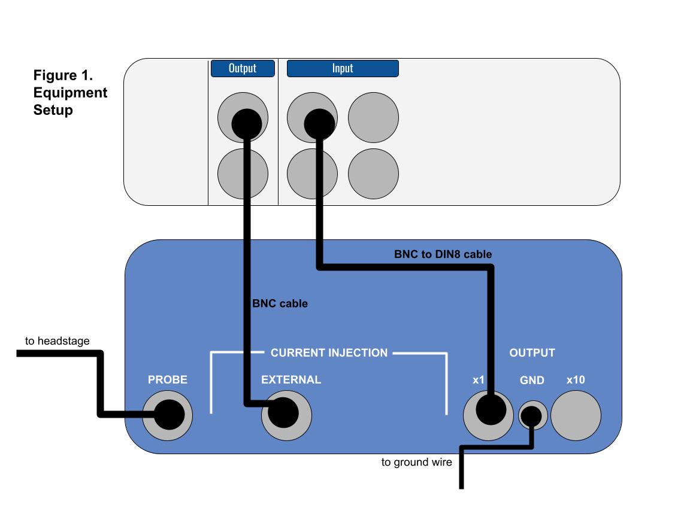
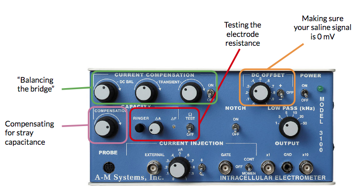
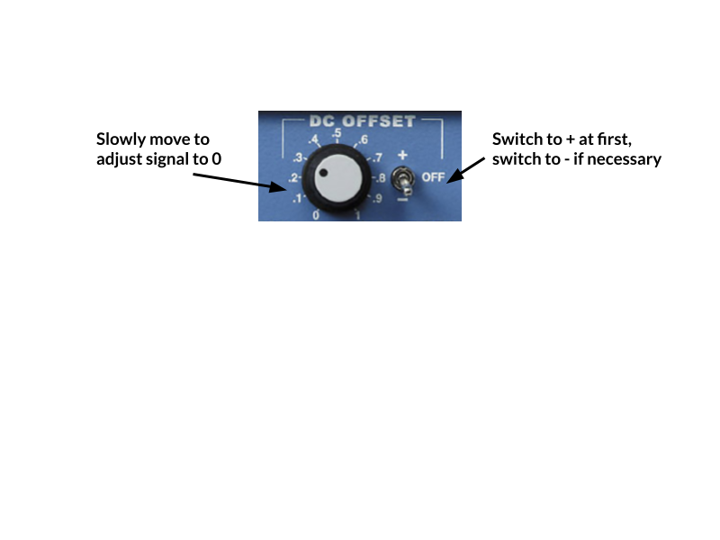
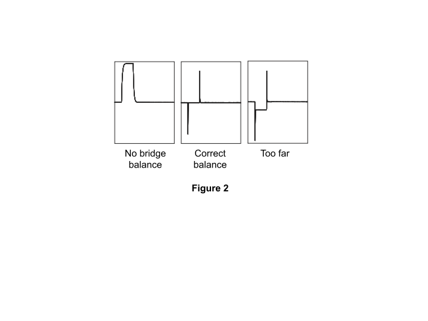

# Intracellular Lab

The goal of this first experiment is to troubleshoot the noise in your rig, learn how to check the electrode resistance, and balance the bridge on your amplifier. You'll also get familiar with the microscope we're using and finding tiny things in a dish.

In subsequent labs, we'll be recording from tiny cells in the leech ganglia, as well as filling these cells with a fluorescent dye. Those experiments will require that you can quickly identify and manipulate a microelectrode underneath the microscope in order to find your cell of choice. Time is of the essence here — we're keeping cells alive in a dish, and they won't last forever. Becoming proficient at these steps will save you time during the recording experiments, and therefore increase your likelihood of success.

| **Supplies** | **Cables & connectors** | **Solutions** |
|---|---|---|
| Clear plastic holder for petri dish | DIN8 plug to BNC Cable (MLAC25) | 3M KCl |
| PowerLab 26T, connected to computer | BNC Cable | Saline |
| A-M Systems 3100 Intracellular amplifier & silver head stage probe | Banana plug cords (5) | |
| Microelectrode holder (AM Systems #675440) | Alligator clip adapters (5) | |
| Microelectrode (BF100-58-10) | Ground wire & clay or wax | |
| Faraday Cage | | |
| Metal baseplate & foam pads | | |
| Micromanipulator & stand | | |
| Stereomicroscope on boom stand | | |
| Light source | | |
| Syringe & needle | | |
| 4 cm diameter petri dish with saline | | |
| 4 cm diameter petri dish with microbeads | | |

---

## I. Tiny beads, optics, & manipulators

This first activity will prepare you for recording from a leech ganglion. The steps you take to set up your microscope, light source, and manipulator will be almost identical next week. You might have already used a microscope before, but it's less likely that you've had to do something very precise while doing so!

### Determining the diameter of your viewing field

1. Compute the total magnification of your microscope at 1.8X by multiplying 1.8X times the objective magnification (typically 10x, check your oculars). Write this value in Table 1.
2. Similarly, compute the total magnification for ~5X and 11X. Write these values in Table 1.
3. Place the ruler underneath the microscope at 1.8X and look through the oculars. Determine the diameter of your viewing field and record this in Table 1.
4. It'll be tough to do the same at high magnification, so instead we can use this formula:

   > high power field diameter = (low power field diameter × low power magnification) ÷ high power magnification

5. Using this equation, determine the diameter of the viewing field for 5x and 11x.

**Table 1.**

| Objective | Total Magnification | Diameter of viewing field (mm) |
|---|---|---|
| 1.8x | | |
| 5x | | |
| 11x | | |

### Setting up your lights and microscope

1. First, set your dish with microbeads into the clear acrylic holder. Be careful placing these into the holder — it's designed to fit on the ledge inside.
2. Arrange your lights so that they're shining onto the dish.
3. Bring the beads into focus at a low magnification (1.8–3x).
4. Move to the highest magnification, and bring the beads into focus. Adjust your light source so that the beads are clearly visible.
5. Use your calculated viewing field diameter to estimate the size of the smallest bead in your dish.

**Given the diameter of your viewing field, what is your estimated diameter of the smallest microbead in your dish?** ______________________

### Using your manipulator

1. Get a microelectrode from the front and use the syringe to fill it with KCl.
2. Gently put the microelectrode onto the wire of the microelectrode holder and screw it in.
3. Put the micropipette holder into the silver headstage by pushing the gold pin into the bottom.
4. Make sure that your manipulator arm is at a right angle. Any angles that are not perpendicular will make it difficult to maneuver your micropipette.
5. Move the manipulator base (you need to turn the magnetic switch to OFF) close to the dish so that the tip of the "electrode" is within 3 inches of your dish.
6. Use the knobs on the manipulator to bring the tip of your pipette about ½ inch above your beads.
7. Bring the focus above the dish so that the tip of the pipette is now in focus.
8. Lower the focus, and bring the tip of the pipette into that field of view.
9. Repeat this until the tip of the pipette is at the same focus as the glass beads.
10. At a high magnification (11X), you should see the glass beads being repelled by the tip of the pipette, or be able to push them around.
11. Once you have the tip of your pipette at the same focus as your beads, raise your electrode and remove the dish of beads.

**Troubleshooting**

| Observation | Likely issue(s) | Possible solution |
|---|---|---|
| The view through the scope is blurry | You're out of focus | Adjust the focus |
| There are weird light artifacts and reflections that make it difficult to see | The light is not set up well | Change the angle, intensity, and distance of the light source. Try 1 light source vs. 2. |

---

## II. Preparing your recording setup

### Setting up PowerLab & the Amplifier

1. Make sure that your PowerLab is off.
2. Configure your PowerLab & amplifier as in Figure 1:

*Figure 1. Equipment setup.*

The amplifier settings should be as follows:

| Setting | Value |
|---|---|
| DC Offset knob | Counterclockwise |
| DC Offset (+/Off/−) | Off |
| Transients | Counterclockwise |
| DC Balance | Counterclockwise |
| Low Pass | 5 kHz |
| Ω TEST | Off |
| Notch | Off |
| Capacity Compensation Knobs | Fully counterclockwise |
| Current Injection | Fully counterclockwise (zero) — **VERY IMPORTANT!** |
| Current Injection Knob (Cont/Off/Momen) | Off |

3. Once everything is connected, turn on your PowerLab and the Amplifier.

   **Note:** The AM 3100 amplifier needs to warm up for 5 minutes before doing any recording. You can proceed to set up your electrode though.

### Prepare the saline, manipulator, electrode, and ground wire

- Your manipulator and electrode should already be set up from Step I. However, if you broke your electrode during Step I, you should prepare a new one.
- Fill a small petri dish with saline and put it into the holder.
- Using the clay, position the ground wire so that it is in the saline but at the edge of your petri dish. Your ground wire should be plugged into "GND" on the amplifier. You may need to piggy-back it onto another banana plug cord to do so.

---

## III. Noise, resistance, and balancing the bridge

### Check for noise in your signal

First things first — with this recording configuration, we'll probably pick up much more noise than we need to troubleshoot.

1. Maneuver the tip of the microelectrode into the saline.

   **Note:** Be very careful while moving your microelectrode around! If you break the tip of it, you'll need to get a new electrode.

2. Open LabChart with the Leech Settings file (http://bit.ly/labchart).
3. Open the Input Amplifier for your recording ("Action Potential") channel.
4. Change the zoom on your signal and the range (if necessary) so that your signal fills about ⅔ of the screen.
5. Chances are you'll see 60 Hz noise. In order to get rid of this, ground (one-by-one, watching to see how they change the signal) your: Faraday cage, metal plate, microscope, and light (clip on to the metal parts) to the ground pin on the back of the PowerLab. It will help to piggy-back banana plug cords.
6. Once you've reduced your noise as much as possible, you can move on.

   **Note:** As you're moving things around your rig, make sure that your lights can reach your petri dish and that you can easily manipulate the electrode & knobs on your amplifier.

For the next steps, you'll need to use these knobs on your amplifier:

### Check the resistance of your electrode

1. With the Input Amplifier window open, note the voltage of the trace. It will likely not be exactly at zero. This is due to the slight differences in the potentials of the ground and recording electrodes, and will change when you change electrodes.
2. Switch the DC OFFSET to positive (+). Using the DC OFFSET knob on the amplifier, position the tracing so that it is very close to 0 volts. You may need to set the switch next to DC OFFSET to negative (−) depending on what direction you need to move your signal.

   

   **Note:** If the voltage is drifting wildly, make sure that your ground wire is in place in the saline and that everything is still grounded properly. Restarting LabChart & turning on/off the PowerLab is also a good troubleshooting step.

3. With the tip of your electrode in the saline, press Start in LabChart. You should be viewing in Chart mode.
4. Very quickly, turn on and off the Ω TEST on the Amplifier. This Ω TEST sends 10 nA of current into the electrode.
5. Press Stop in LabChart.
6. For the data you just recorded, autoscale the channel in time and voltage so that you can clearly see a square wave pulse.
7. If your waveform is not square, turn the CAPACITY COMPENSATION knob on the amplifier slightly clockwise and repeat the Ω TEST. You can treat LabChart like an oscilloscope and let it run (press Start) while you do these tests.

   **Note:** Do not turn the CAPACITY COMPENSATION knob too far — it will result in uncontrolled oscillations in your output. If you do this while recording from a cell, you will greatly damage the cell.

8. Once you've squared up your waveform, measure the height of this square wave in volts.

Calculate the resistance of your electrode according to Ohm's Law (V = IR). In the units we're working with here, 1 MΩ = 1 mV / 1 nA. Since the Ω TEST sends 10 nA, with 1X gain a 10 mV shift in the output voltage corresponds to 1 MΩ resistance.

**Electrode resistance = ______________________**

The resistance of your electrode should be between 20–60 MΩ. If it's too high (>60 MΩ), it might be clogged. Use the Ringer button and try again. If it's too low (<20 MΩ), the tip of your electrode probably broke — get a new electrode.

### Balancing the bridge for current injection

We need to balance the bridge circuit of the amplifier if we want to inject current into a cell. The cell and the electrode each have their own capacitance and resistance. You dial out the resistance of your electrode before you impale the cell; otherwise your recording will reflect the voltage change across the electrode, instead of the actual voltage of the cell.

1. Set the CURRENT INJECTION (CONT-OFF-MOMEN) switch to CONT and the μA knob rotated fully counterclockwise.

   **Note:** If this switch is not on CONT (continuous), no current will be injected.

2. Go to the Setup menu and select Stimulator. Set up the Stimulator to deliver a 10 mV (1 nA current) as a train of 100 pulses:

   | Parameter | Value |
   |---|---|
   | Start Delay | 0 seconds |
   | Repeats | 100 |
   | Max Repeat Rate | 0.66 |
   | Pulse Height | 0.01 V (10 mV) |
   | Pulse Width | 1 s |

3. Set Channel 2 as your stimulus Marker Channel.
4. Close the Stimulator dialog and open the Stimulator Panel. Start recording, and if necessary zero the electrode again using the DC OFFSET knob.
5. Turn the stimulator on to inject a train of 1 nA of current pulses.
6. Adjust the DC BALANCE knob as necessary to remove the electrode voltage drop from the output signal.
7. There will still be "rabbit ears" or transients — these are large spikes when you turn the current on and off — but very little change in standing voltage:

   
   *Figure 2. Bridge balance traces.*

8. Adjust the Current Compensation TRANSIENT controls to minimize transients occurring when the current is gated on and off. The left knob controls the slope of the transient, the right knob controls the peaks.
9. Stop recording.
10. Set the CURRENT INJECTION knob back to OFF.
11. Save your data as "Leech electrode setup". If you made any changes to the settings file (e.g., Channel names, range, etc.) you'll also want to save it as a new settings file by going to File > Save As LabChart Settings File. Save this in a safe, clouded place.
12. Do not move any of the knobs or cords. You'll need these to be in place for the next lab.
