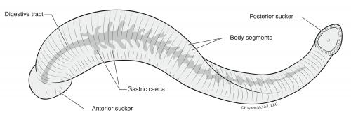
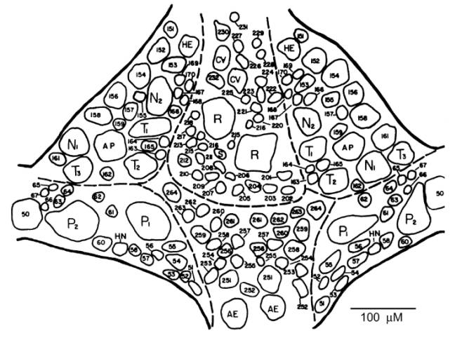
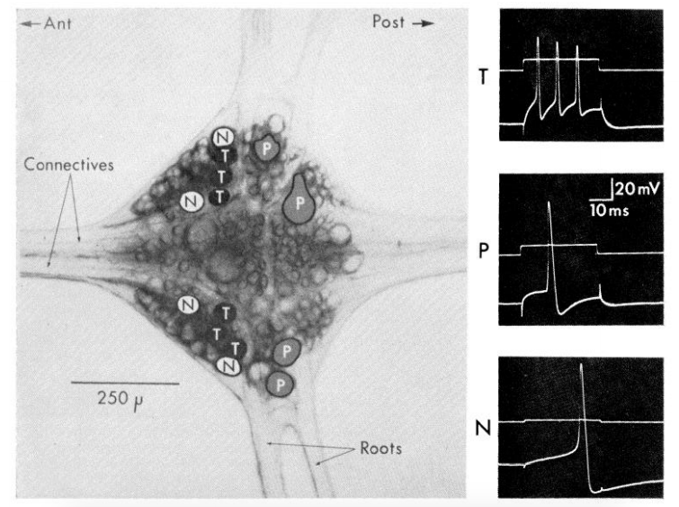

# Leech Electrophysiology

## Background & Goals

### Leeches as a model for neuroscience

It might seem strange, but leeches are fantastic models for neuroscience experiments. They have a rich, well-defined repertoire of behaviors and an easily accessible, stereotyped nervous system. Over the next few labs, we'll record from the medicinal leech, *Hirudo medicinalis*, to determine some physiological and morphological properties of neurons.

### Leech nervous systems

Leeches are annelids (segmented worms), just like our earthworm friends. They have a ventral nerve cord containing a total of 32 ganglia: 4 fused head ganglia, 21 segmental body ganglia, and 7 fused tail ganglia. We'll be recording from the body ganglia.

Each ganglion has about 400 neurons in it, most of which are paired — in other words, most of them are connected to one other neuron. The ganglia are all connected via connectives that run the length of the leech. In addition, each segmental ganglion has lateral roots that reach out to the skin. The neurons in each ganglion are laid out in stereotypical positions, and have well-defined electrophysiological properties. We'll be looking at the ganglion from the ventral side, where many neurons are accessible:

*Adapted from Macagno (1980), "Number and Distribution of Neurons in Leech Segmental Ganglia."*

### Types of cells in the leech

- **Rz (Retzius):** the biggest cells of the leech ganglion, located in the middle of the ventral side of the ganglion. These cells often show a second component in their action potential due to the close electrical coupling with the other Rz cell. These cells do not overshoot.
- **Sensory neurons:** Each of these neurons projects its axon from the ganglion to a particular territory of the skin, where they have specialized mechanoreceptors. Unlike the Rz cell, these sensory neurons have overshooting, very high amplitude action potentials.
  - **T (touch):** three of these in the anterolateral packets on each side of the ganglion. Typically a very short, relatively low amplitude waveform (compared to other sensory neurons).
  - **P (pressure):** two of these in each posterolateral packet.
  - **N (nociception):** two in each of the anterolateral packets. These cells have very long undershoots.
- **AP (anterior pagoda):** large cells near the center of the anterolateral packets.
- **AE (annulus erector):** motor neurons to the AE muscles in the body wall; medium-sized cells in the posterior ventromedial packet.
- **S:** an unpaired cell, unlike the cell types listed above, much smaller than the other neurons listed. Record from this neuron and you shall gain infinite respect from the Gods of leech neurobiology.

*Adapted from Nicholls & Baylor (1968), "Specific modalities and receptive fields of sensory neurons in the CNS of the leech."*

### About the microelectrode & amplifier

Instead of using a wire, we'll be recording from these cells with a glass pipette that has been pulled to have a very tiny and sharp tip and is filled with conductive fluid. These are typically called microelectrodes. Recording from nervous systems in this way was a huge leap forward in 1949 — before then, we weren't able to record from inside of cells (Ling & Gerard, 1949).

Back in the day, physiologists would make these small pipettes by pulling the glass over a flame. Now, we've got a dedicated machine to pull pipettes, allowing us to reproduce many microelectrodes that are the same size.

And about the size — these micropipettes are really small. This small cross-sectional area of the microelectrode greatly reduces the flow of current through the electrode. In other words, it has a really high resistance (often imprecisely termed "impedance" in electrophysiology circuits). This is the quality that allows us to record very tiny changes in voltage in our cells.

This high resistance is necessary, but also brings up some other problems. With really high resistance across our electrode, membrane, and PowerLab, we would almost record no voltage from a 60 mV cell.

So, for these labs, we're using a different amplifier. Because the impedance of our microelectrodes is much higher than the electrodes we used for the earthworm, we need an amplifier that can "impedance match" the microelectrode with the PowerLab. It also means that the intracellular recording system must be shielded from electrical noise much more than the extracellular system.

But with all this in place, you'll get a chance to see some real action potentials from a strange, slightly terrifying creature.

**In these labs you will:**

- Learn how to operate and calibrate an intracellular amplifier
- Record action potentials from Retzius cells, both with and without current injection
- Fill a single cell in the leech with a fluorescent dye to visualize its structure

### What's coming up

This module spans **three lab days**:

- **[Intracellular Lab](IntracellularLab.md)** — troubleshoot noise, check electrode resistance, and balance the bridge on the intracellular amplifier.
- **[Retzius Recording](RetziusRecording.md)** — find and record from a Retzius cell, both spontaneously and with current injection.
- **[Filling the Retzius Cell](FillingRetziusCell.md)** — fill a leech neuron with a fluorescent dye and image it under the microscope.

### Resources

- [HHMI Virtual Leech Lab](https://www.hhmi.org/biointeractive/neurophysiology-virtual-lab)
- [JOVE Video: Intracellular Recording & Sensory Field Mapping](https://www.jove.com/video/50631/intracellular-recording-sensory-field-mapping-culturing-identified)

### References

- Macagno, E.R. (1980) Number and distribution of neurons in leech segmental ganglia. *Journal of Comparative Neurology* 190(2): 283–302.
- Nicholls, J.G. & Baylor, D.A. (1968) Specific modalities and receptive fields of sensory neurons in CNS of the leech. *Journal of Neurophysiology* 31(5): 740–756.
- Ling, G. & Gerard, R.W. (1949) The normal membrane potential of frog sartorius fibers. *Journal of Cellular and Comparative Physiology* 34(3): 383–396.
