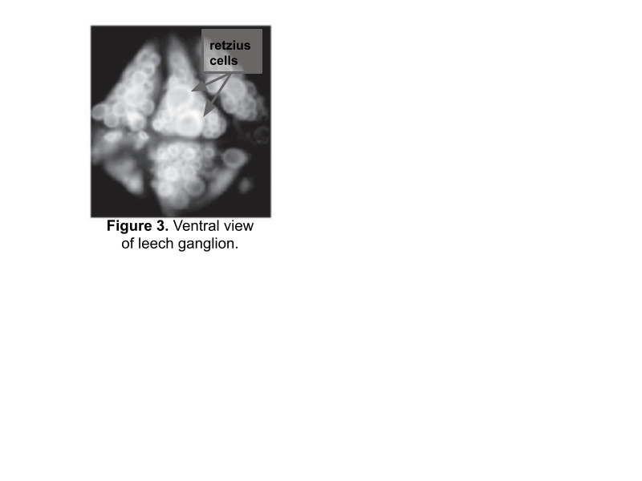

# Retzius Recording

Now that you're comfortable with the microscope, manipulator, and amplifier, it's time to record from a real leech ganglion. In this lab, you'll find and impale a Retzius cell, characterize its spontaneous firing, and inject current to see how it responds.

## I. Preparing for recording

First, you need to fill and arrange your electrode, troubleshoot noise, and configure your amplifier in the same way that you did in the [Intracellular Lab](IntracellularLab.md).

Once you've confirmed that your manipulator and recording equipment is ready to go, get a leech ganglion.

1. Maneuver your electrode into the saline bath. At the moment, there isn't any need to get it close to the ganglion — as long as it's in the saline, you can measure the resistance and troubleshoot noise.
2. Make sure the peak-to-peak noise level of your recording is < 5 mV. There shouldn't be any obvious sinusoidal noise in your data. If there is, find the source and ground it.
3. Test the resistance of the electrode (follow the steps from the previous lab):

   **Electrode resistance:** ______________________

4. Balance the bridge — it shouldn't be too far off since it should be balanced from the previous lab.

### Getting your leech & microelectrode in focus

Before we can do any recording, we need to ensure that your light is set up well so that you can see your ganglion.

1. Gently rest your petri dish in the plastic holder.
2. Bring the leech ganglia into focus, and adjust your light and equipment positioning as necessary.
3. When you can clearly see your ganglia, see if you can spot the two Retzius cells in the middle (Figure 3).

   
   *Figure 3. Ventral view of leech ganglion.*

   **Note:** If you cannot see the two Retzius cells, it might be because your lighting needs to be adjusted, or because your ganglia is mistakenly set with the ventral side up.

4. Using the clay, position the ground wire so that it is in the saline but at the edge of your petri dish. Your ground wire should be plugged into "GND" on the amplifier.

## II. Recording from a Retzius cell

### Finding and impaling a Retzius cell

1. Slowly and carefully move the tip of your electrode down towards the ganglia, until it is very close to the Retzius cells.

   **Note:** It helps to do this at medium magnification (5–8X) but in the end, you should be looking at your cells and electrode at the highest magnification possible (11X).

   **Note #2:** The tip of your electrode will probably be very hard to see. You can move it slightly from side to side if you lose track of it. You may need to adjust your light source so that you can see both the ganglion and the tip of the electrode.

2. While hovering above the cell but before getting too close, check your resistance again. Be sure to also keep the recording voltage close to zero while you're outside of the cell.
3. Once you think you're as close as possible to the cell, even dimpling the cell under the pressure from the electrode tip, start recording.
4. Firmly tap the electrode to encourage it to enter the cell. While tapping, watch the recording screen.
5. If you entered the cell, you should see your membrane potential rapidly drop to about −50 mV and stay there.

   **Note:** If your membrane potential goes below −65 mV, you're likely in a glia cell.

6. If all goes well, you should see your Retzius cell firing very clear spontaneous action potentials!
7. If your first attempt is unsuccessful, slightly advance the electrode towards the cell and try again. If this doesn't work, reposition the electrode to a different part of the cell and try again. Frequently check the resistance of your electrode to ensure that it is not broken or clogged.

Once you have successfully impaled a Retzius cell, take note of the resting membrane potential of the cell:

**Resting membrane potential:** ______________________

**Note:** The resting membrane potential will change slightly over time. Your most accurate measurement will be from when you first pierce the cell.

Also take note of the shape of this action potential. Does it overshoot (past zero)? Does it undershoot?

### Recording spontaneous action potentials ★

We'll collect 10 different 10 second windows of spontaneous action potentials from your cell, in order to estimate the spontaneous firing rate and measure the action potential height, spike width, and after-hyperpolarization of your cell.

**Note:** You can also do this with the data you recorded directly after you impaled the cell. But having 10 separate windows will make it a bit easier to calculate the spontaneous firing rate.

1. Configure Scope View to collect data with a 10 second duration.
2. Set repeats to 10, and press Start.
3. Confirm that you have 10, 10 second recordings with spontaneous action potentials by looking through your pages.

You will ultimately use this data to fill in Table 1, but don't take the time to do this now. Move on to stimulating your Retzius cell while you have one.

## III. Stimulating the Retzius cell ★

Once you have characterized the spontaneous activity of your cell, we can also inject current to see how the cell responds to inputs.

1. Set up your Stimulator as a pulse with the following parameters:

   | Parameter | Value |
   |---|---|
   | Delay | 5 ms |
   | Max Repeat Rate | 0.5 Hz |
   | Repeats | 1 |
   | Duration | 500 ms |
   | Pulse Height | 10 mV (PowerLab will tell the amp to send 1 nA for each 10 mV) |

2. Make sure that your CURRENT INJECTION toggles are on positive (+) and CONT.
3. Configure Scope View in LabChart so that you can see one, 1 second sweep when a stimulus pulse is sent.
4. Press Start to send current into your cell. Observe whether or not this elicits action potentials from the cell, and whether the cell adapts to the stimulus.
5. Repeat the stimulation 10 times (or more, if it seems highly variable). You'll need these repeats for your spike train metrics in your lab report.

   **Note:** For this step, do not use averaging. Averaging will repeatedly send the same stimulus with only a short break. Give the cell a few seconds to recover in between stimuli.

6. Repeat the stimulation with the following current levels (with 10 repeats per current level): −0.5 nA, 1.5 nA, 2.0 nA. You'll ultimately need to count the number of action potentials for each of these (you should have four different current levels total) for a figure in your lab report.

## Sample data notebook for Retzius cell recording

**Table 1.** Spontaneous action potential characteristics.

| Action Potential | AP Height | AP Spike Width | After-hyperpolarization Amplitude |
|---|---|---|---|
| 1 | | | |
| ... | | | |
| Mean (or Median) | | | |
| SD (or IQR) | | | |

*Note: This table is a suggestion for how to ultimately collect data for this portion of the report. Set up a similar table after you have collected your data.*

**Table 2.** Characteristics of spike trains elicited by a 500 ms, 1 nA square wave stimulus.

| Trial | Latency to spike | First interspike interval (ISI) |
|---|---|---|
| 1 | | |
| ... | | |
| Mean (or Median) | | |
| SD (or IQR) | | |

*Note: This table is a suggestion for how to ultimately collect data for this portion of the report. Set up a similar table after you have collected your data.*
